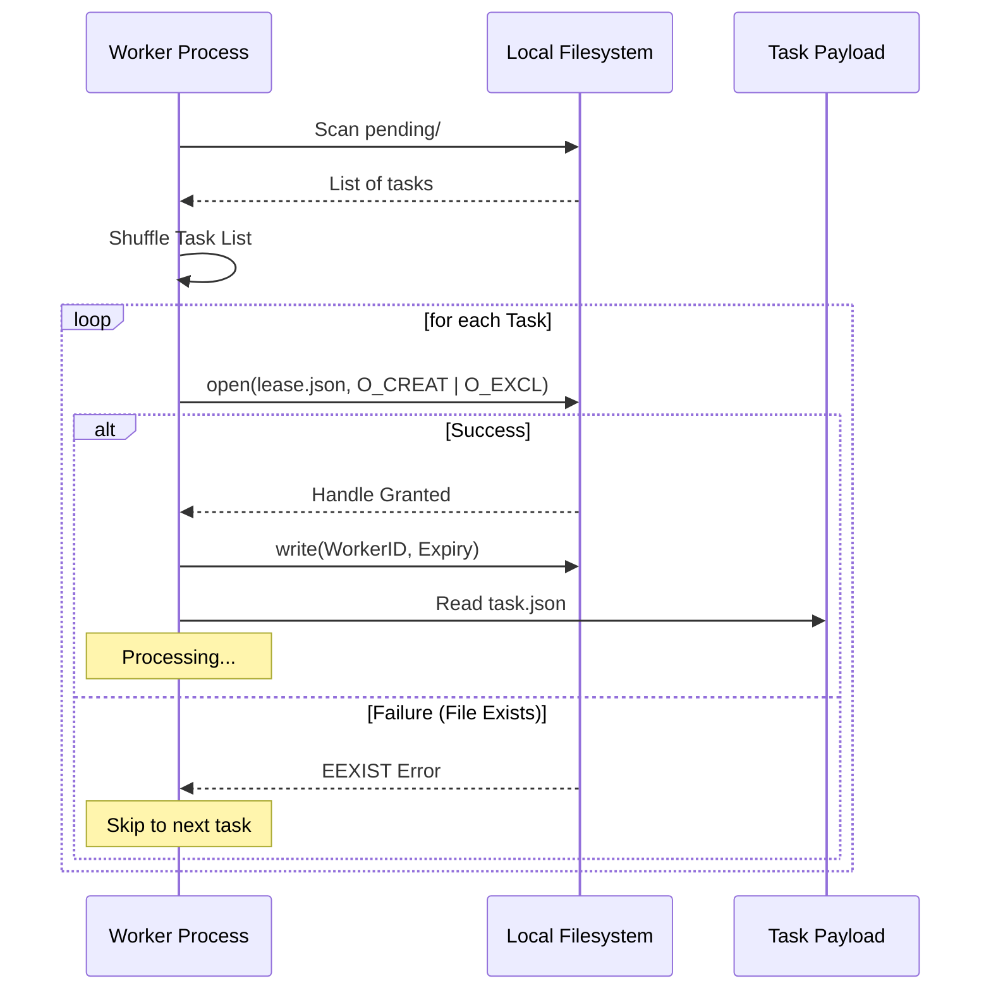

# Local Lease Lifecycle

This document describes how a single worker node (e.g., one Raspberry Pi) ensures that multiple internal worker processes do not attempt the same task simultaneously.

## Atomic Claim Logic
The local filesystem acts as the primary synchronization point for processes on the same host. We use the `os.O_CREAT | os.O_EXCL` flags to ensure that only one process can successfully create the `lease.json` file.

1. **Shuffle**: The worker shuffles the list of pending tasks to reduce the chance of two nodes starting at the exact same point in the queue.
2. **Atomic Open**: The worker attempts to open `lease.json` in the task directory.
   - If the file exists, the OS returns an error immediately.
   - If the file does not exist, the OS creates it and grants the worker an exclusive handle.

## Local Sequence Diagram

## Internal Heartbeat
Once a local lease is acquired, the worker process updates the `heartbeat_at` timestamp inside the file every 60 seconds. This prevents other processes on the same node from reclaiming the task if the main work loop is still active but slow.
