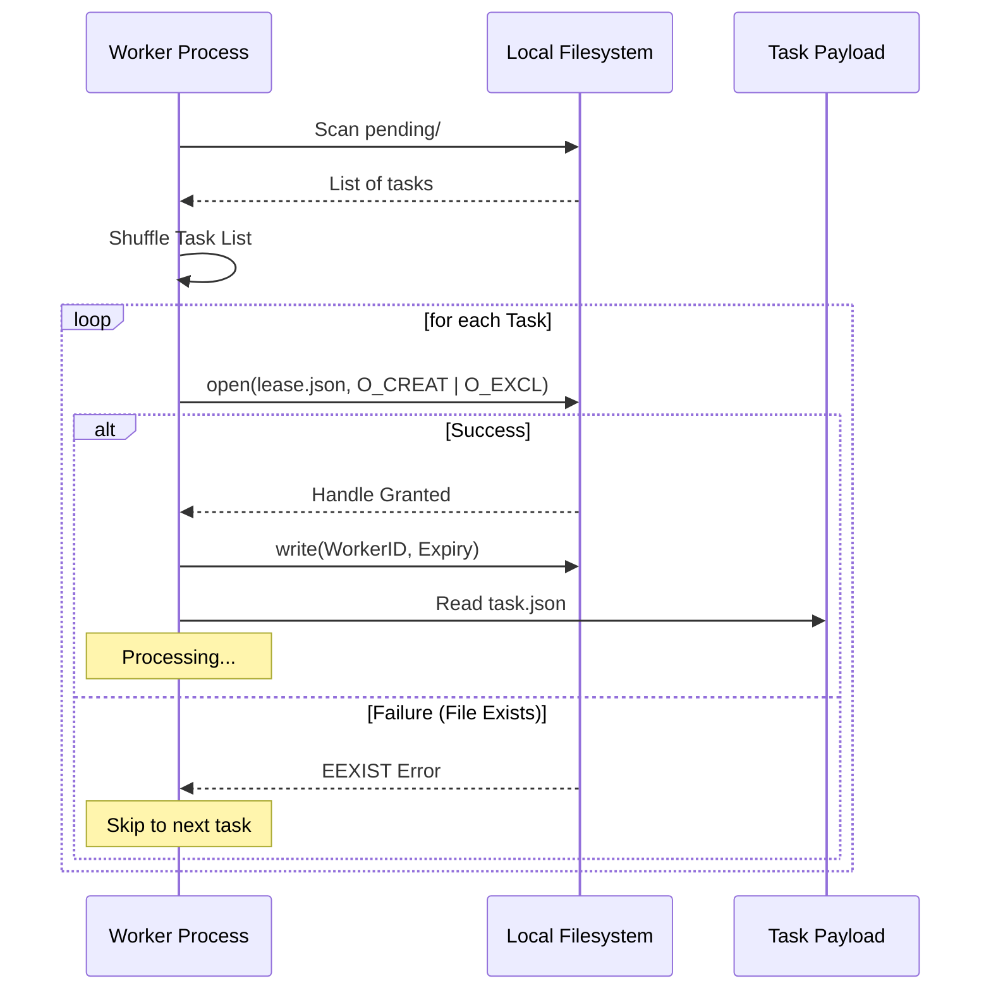

# Local Lease Lifecycle

This document describes how a single worker node (e.g., one Raspberry Pi) ensures that multiple internal worker processes do not attempt the same task simultaneously.

## Atomic Claim Logic
The local filesystem acts as the primary synchronization point for processes on the same host. We use the `os.O_CREAT | os.O_EXCL` flags to ensure that only one process can successfully create the `lease.json` file.

1. **Shuffle**: The worker shuffles the list of pending tasks to reduce the chance of two nodes starting at the exact same point in the queue.
2. **Atomic Open**: The worker attempts to open `lease.json` in the task directory.
   - If the file exists, the OS returns an error immediately.
   - If the file does not exist, the OS creates it and grants the worker an exclusive handle.

## Local Sequence Diagram

## Requirements for Shared Storage

While this logic is primarily used for processes on a single device, it **can** be extended to multiple devices (e.g., a cluster of Raspberry Pis) using shared network storage, provided the storage protocol supports atomic creation.

### Compatibility Matrix
| Storage Type | Supports `O_EXCL`? | Multi-Device Safe? | Notes |
| :--- | :---: | :---: | :--- |
| **Local Disk (ext4/XFS)** | ✅ Yes | No | Locked to a single physical device. |
| **NFS v2 / v3** | ❌ No | ❌ No | `O_EXCL` is often broken or non-atomic across clients. |
| **NFS v4** | ✅ Yes | ✅ Yes | Supports atomic `OPEN` with `CREATE_EXCLUSIVE`. |
| **SMB / CIFS (Samba)** | ✅ Yes | ✅ Yes | Robust support for exclusive creation and file locking. |
| **S3 (via FUSE/Mount)** | ❌ No | ❌ No | Most S3-FUSE drivers do not support atomic `O_EXCL`. |

### Resource Burden of Hosting a Shared Queue

Hosting a shared filesystem (SMB/NFS) on a Raspberry Pi that is also acting as a worker is feasible, but the burden varies based on the protocol and storage hardware.

| Resource | Impact (NFSv4) | Impact (Samba) | Characterization |
| :--- | :---: | :---: | :--- |
| **CPU** | Very Low | Low-Moderate | NFS runs in kernel-space; Samba runs in user-space and handles more complex negotiation/encryption. |
| **RAM** | Negligible | ~20-50MB / client | Samba scales linearly with the number of connected nodes. |
| **I/O** | **High** | **High** | **The primary bottleneck.** Small file metadata ops (creating/deleting leases) are intensive for SD cards. |

#### Recommendations for the Host Node
1. **Storage Medium**: **Avoid SD cards for the host.** A USB 3.0 SSD is highly recommended to handle the IOPS required for thousands of atomic lease operations without pinning the CPU in `iowait`.
2. **Dedicated vs. Shared**: 
   - A **Pi 5 (8GB)** can easily host the queue and run 4-8 workers simultaneously if using an SSD.
   - A **Pi 4 (4GB)** is better suited as a dedicated host or a "host + 1 worker" if the queue grows beyond 5,000 items.
3. **Network**: Ensure the host is on a wired Gigabit connection to minimize latency for the atomic `O_EXCL` round-trips from client nodes.
