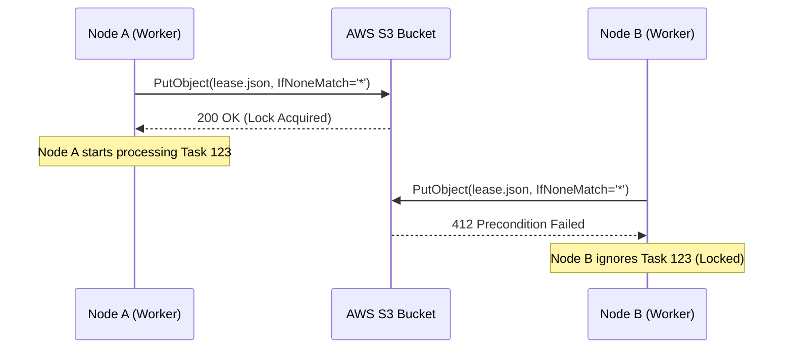

# S3/Global Lease Lifecycle

This document describes how coordination occurs across multiple nodes in the cluster (e.g., Pi-A vs Pi-B) using S3 as a shared state store with **Atomic Conditional Writes**.

## Atomic Global Claim (ADR 011)
We use S3's support for `If-None-Match: "*"` to implement a globally atomic lock. This eliminates the race conditions inherent in simple sync-based coordination.

1. **Atomic Put**: When a worker identifies a task candidate, it attempts to write a `lease.json` directly to S3.
2. **Precondition Check**: The S3 API will only allow the write to succeed if the file **does not already exist**.
   - **Success (200 OK)**: Task is claimed. No other node can claim it.
   - **Failure (412 Precondition Failed)**: Another node has already claimed the task. The worker must skip to the next candidate.

## Global Sequence Diagram

## Discovery vs. Synchronization
While the **Claim** is atomic, the **Discovery** of tasks still relies on listing S3 prefixes.

* **Immediate Uploader**: Once a node completes a task, it pushes the results and removes the S3 task/lease immediately.
* **Randomized Sharding**: To avoid scanning the entire `pending/` prefix, workers use [Randomized Prefix Sharding](sharding.md) to discover tasks in subsets of the keyspace.
* **Sync Interval**: Throttled sync loops (every 5–15 minutes) are still used for background maintenance, but the core task distribution no longer depends on them.
