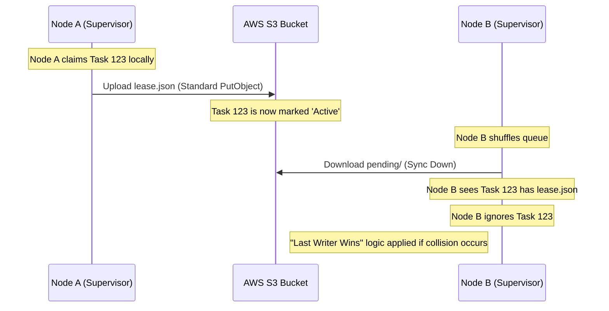

# S3/Global Lease Lifecycle

This document describes how coordination occurs across multiple nodes in the cluster (e.g., Pi-A vs Pi-B) using S3 as a shared state store.

## Relaxed Consistency (Sync Loop)
Because S3 does not natively support atomic `O_EXCL` operations across different clients without complex locking, we use a "Sync and Converge" approach managed by the **Supervisor**.

1. **Sync Up (5m)**: Every 5 minutes, the Supervisor pushes all locally held `lease.json` files to S3.
2. **Sync Down (60m)**: Every 60 minutes (or on demand), the Supervisor pulls down the state of the `pending/` directory from S3 to see which tasks other nodes have claimed.

## Global Sequence Diagram

## The "Safe Race" Window
The **5-minute reporting interval** creates a window where Node B might claim a task before Node A's lease has been uploaded to S3. 

* **Consequence**: Two nodes might enrich the same website simultaneously.
* **Mitigation**: Our tasks are **idempotent**. Both nodes will write the exact same result to the same company folder on S3. The only cost is a small amount of duplicate bandwidth and compute.
* **Benefit**: Throttling the reporting to 5 minutes drastically reduces S3 "List" costs and prevents I/O lockups on Raspberry Pi SD cards during massive file scans.

## Potential Future: S3 Conditional Writes
We are exploring moving to S3-native atomic leases using the `--if-none-match "*"` header. This would allow a worker to claim a task globally in one atomic step without waiting for a supervisor sync loop.
