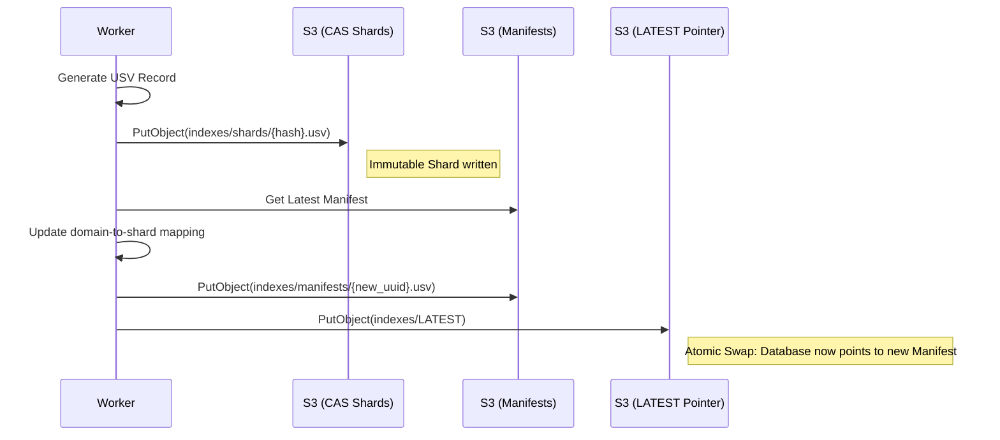
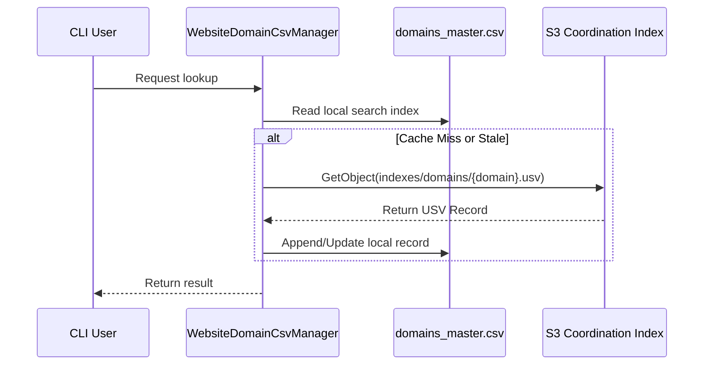

# Index Lifecycle & Synchronization

The DFI ensures that distributed workers can record their findings immediately while CLI users enjoy a high-performance local view.

## Distributed Update Lifecycle
When a worker completes a scrape, it follows an "Atomic Swap" pattern to ensure consistency.

## Local Search Index Reconciliation
The local `domains_master.csv` is a "materialized view" of the global state.

## Consistency Model
- **Coordination Index**: Strong consistency per domain (Latest write wins).
- **Search Index**: Eventual consistency. Local CSVs are updated during `aws s3 sync` or when the CLI explicitly fetches a domain record.
- **Company Store**: Strongly consistent with the task that generated it.
