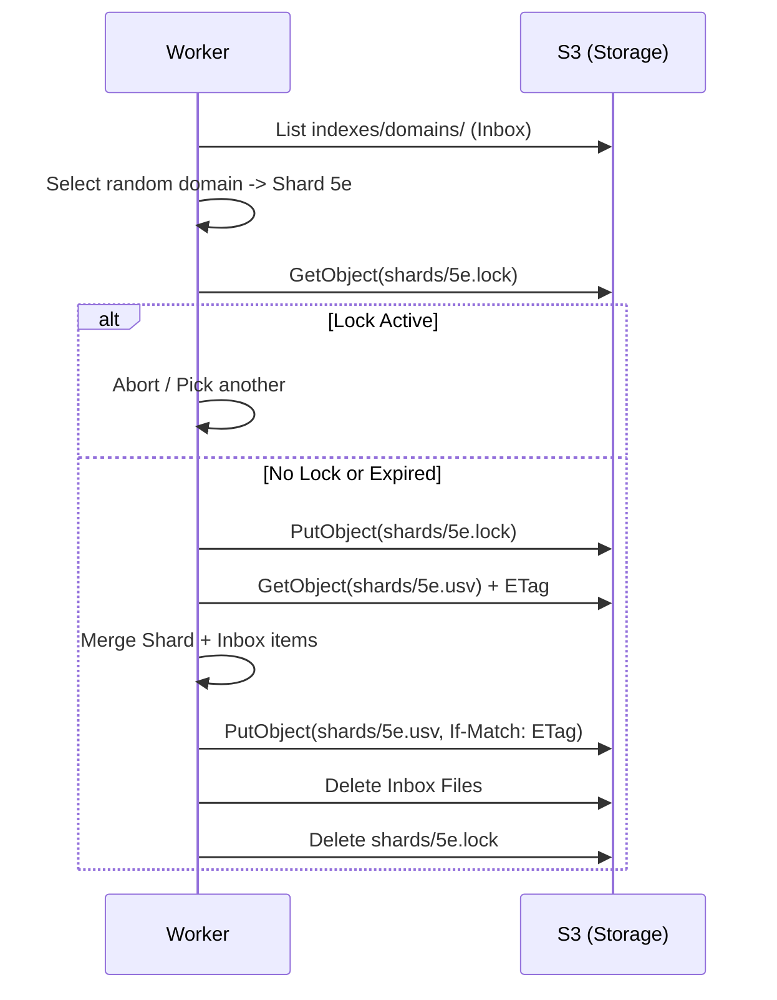

# ADR 013: Distributed Compiler & Locking Strategy

## Status
Proposed

## Context
In a distributed environment (Fargate workers, Raspberry Pis), multiple processes may attempt to compact the "Inbox" into the "Shards" simultaneously. Without coordination, this leads to race conditions, lost updates, and corrupted manifests.

## Decision: The "Stochastic Distributed Compiler"

We will implement a locking mechanism using S3 objects as semaphores, combined with optimistic concurrency control for the final write.

### 1. Shard Selection (Stochastic)
To prevent workers from clumping on the same shard:
1.  List a random page of objects in `indexes/domains/`.
2.  Select a random file (e.g., `example.com.usv`).
3.  Calculate the Shard ID (e.g., `5e`) for that domain.

### 2. The Lock (Advisory)
Before processing Shard `5e`, the worker must acquire an advisory lock.
- **Path**: `indexes/domains/shards/5e.lock`
- **Content**: JSON containing `worker_id`, `created_at`, and `expires_at` (default 5 minutes).
- **Acquisition**:
    - If the lock file exists and `expires_at` is in the future, the worker aborts and picks a different shard.
    - If it doesn't exist, the worker writes its own lock file.

### 3. Compaction Process
Once the lock is held:
1.  **Scan**: List all inbox files in `indexes/domains/` that hash to `5e`.
2.  **Read**: Download the current shard `indexes/domains/shards/5e.usv` (if it exists) and record its **ETag**.
3.  **Merge**: Combine shard items with inbox items. For duplicate domains, the record with the latest `updated_at` wins.
4.  **Write (Optimistic)**: Upload the new shard USV to `indexes/domains/shards/5e.usv` using the `If-Match: [ETag]` header.
    - If the write fails (HTTP 412), another worker updated the shard first. The current worker aborts and releases the lock.

### 4. Cleanup & Release
1.  **Inbox Cleanup**: Delete the specific inbox files that were successfully merged into the shard.
2.  **Manifest Update**: The manifest only needs to be updated if record counts or schema versions changed significantly. (Note: In DHSI, the shard path is deterministic, so the manifest is less critical for discovery but still useful for statistics).
3.  **Release**: Delete the lock file.

## Sequence Diagram: Locking & Compaction

## Foreseeable Hurdles

1.  **Lock Drift**: Clocks between RPi and AWS might drift.
    - **Mitigation**: Use S3 `LastModified` time or a central NTP sync for all workers.
2.  **Orphaned Locks**: A worker crashes after locking but before releasing.
    - **Mitigation**: Locks must have a short TTL (e.g., 5 mins) and be "stale-checked" by other workers.
3.  **Inbox Listing Latency**: Listing thousands of inbox files to find shard-mates.
    - **Mitigation**: Compilers should ideally process *all* pending inbox files in a single pass if the count is low, or use prefix-based filtering if we ever sub-shard the inbox.
