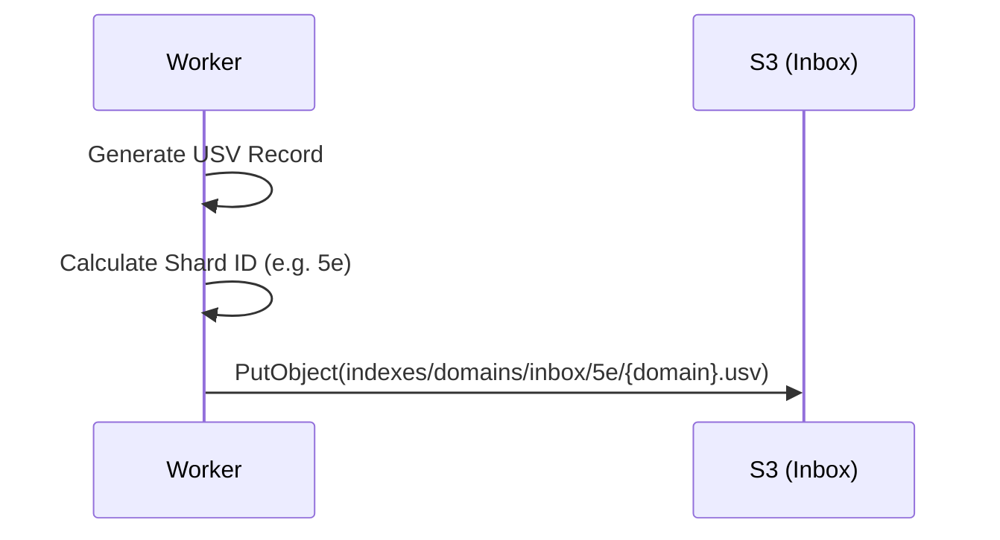
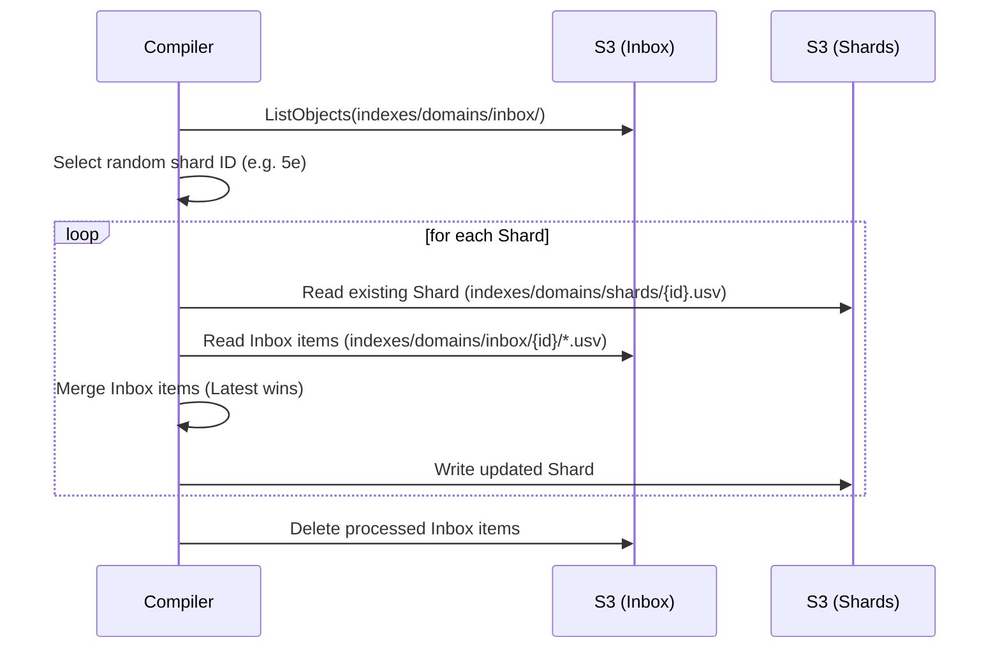

# ADR 013: Deterministic Hash-Sharded Index (DHSI)

## Status
Proposed

## Context
The current **Distributed Filesystem Index (DFI)** (ADR 012) utilizes a "Manifest-Pointer" architecture where a central USV manifest maps every individual domain to its corresponding shard. 

### Problems with ADR 012 at Scale:
1.  **Manifest Bloat**: With 1M+ domains, the manifest becomes a multi-megabyte bottleneck that must be downloaded and parsed for every lookup.
2.  **S3 Read Latency**: The "file-per-domain" write pattern is excellent for concurrency but cost-prohibitive for reads, as S3 is optimized for larger objects.
3.  **Lexicographical Sorting**: Current text-based storage leads to sorting issues (e.g., `10` before `2`) unless manual casting is performed in every query.

## Decision
We will transition to a **Deterministic Hash-Sharded Index (DHSI)**. This architecture eliminates the per-domain manifest by calculating storage locations based on the domain's hash.

### 1. Sharding Strategy
Shard locations are calculated using a stable hash of the domain name.
- **Algorithm**: `SHA-256`
- **Address Space**: First 2 characters of the hex hash (256 shards).
- **Path**: `indexes/domains/shards/{prefix}.usv` (e.g., `indexes/domains/shards/a1.usv`).

### 2. Layered Write-Back Architecture
- **Layer 1 (Inbox)**: High-concurrency landing zone. Workers write atomic `indexes/domains/{domain}.usv` files.
- **Layer 2 (Base Shards)**: High-density USV files containing the bulk of the index (nested in `shards/`).
- **Compiler**: A background process that periodically merges L1 (Inbox) into L2 (Shards).

### 3. Schema Enforcement
Each shard directory will include a Frictionless Data `datapackage.json`. This sidecar allows tools like `DuckDB` and `qsv` to enforce strict typing (integers, datetimes) without binary conversion.

### 4. Robust Identification (The Identity Tripod)
To ensure reliable linking between prospects, index records, and company files, we utilize a `company_hash` based on the "Identity Tripod": **Name**, **Street Address**, and **City**.

- **Algorithm**: `SHA-256` (first 16 characters)
- **Input**: `slugify(name)|slugify(street_address)|slugify(city)`
- **Benefit**: Immune to minor typo corrections in non-tripod fields and ensures uniqueness for multi-location brands.

## Data Model

### Shard Calculation (Python)
```python
import hashlib
def get_shard_id(domain: str) -> str:
    return hashlib.sha256(domain.encode()).hexdigest()[:2]
```

### Metadata Sidecar (`datapackage.json`)
```json
{
  "name": "domain-index",
  "resources": [{
    "name": "shards",
    "path": "shards/*.usv",
    "schema": {
      "fields": [
        {"name": "domain", "type": "string"},
        {"name": "company_name", "type": "string"},
        {"name": "scraper_version", "type": "integer"},
        {"name": "updated_at", "type": "datetime"}
      ]
    }
  }]
}
```

## Sequence Diagrams

### Distributed Write


### Compaction (The Compiler)
The background process that merges the high-concurrency Inbox into the high-density Shards. For detailed coordination and locking logic, see [Distributed Compiler & Locking Strategy](./COMPILER.md).



## Foreseeable Hurdles & Stumbling Blocks

1.  **Partial Deletion during Compaction**: If the compiler crashes after writing a shard but before deleting inbox items, duplicates will exist.
    - **Mitigation**: Queries must use `ORDER BY updated_at DESC` and deduplicate by `domain` (DuckDB `DISTINCT ON` or similar).
2.  **S3 List Limits**: Listing 100k+ files in the `inbox/` can be slow.
    - **Mitigation**: Use S3 Inventory or process the inbox in paginated batches.
3.  **Concurrency during Compaction**: Multiple compilers updating the same shard.
    - **Mitigation**: Implement a simple file-lock (`indexes/domains/shards/{id}.lock`) or use S3 Conditional Writes (If-None-Match).
