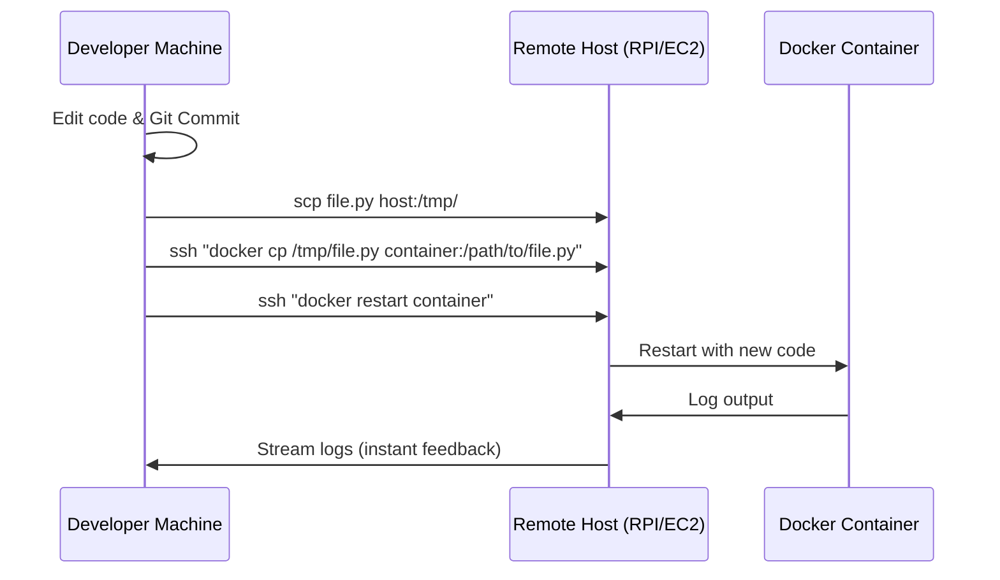

# ADR-002: Docker Worker Stability, Rapid Iteration, and Anti-Bot Persistence

## Status
Accepted

## Context
Developing and maintaining scrapers inside Docker containers (especially on remote Raspberry Pi clusters or AWS Fargate) presents three recurring challenges:
1. **Slow Feedback Loops:** Traditional `docker build -> push -> pull -> run` cycles take 5-10 minutes, making rapid bug fixing and testing nearly impossible.
2. **Anti-Bot Regressions:** Scraping targets (like Google Maps or diverse company websites) regularly update detection logic. We frequently fixed headers only to have them regress or be missed in new scraping paths.
3. **Resource Exhaustion:** Launching separate Chromium instances for every worker task on limited hardware (Pi 4/5) led to memory exhaustion and frequent container crashes.

## Decision

### 1. Rapid Iteration via "Hot-Patching"
Instead of full build cycles, we use a `docker cp` and `docker restart` workflow. This allows code updates to reach a remote worker in seconds.

**Workflow:**
1. Update code locally.
2. Commit changes to Git (ensures source of truth).
3. `scp` changed file to the host.
4. `docker cp` file from host to container.
5. `docker restart` the specific supervisor/worker container.

**Sequence Diagram:**


### 2. Centralized Anti-Bot Headers
To prevent regressions, all browser headers are centralized in `cocli/utils/headers.py`.

```python
# cocli/utils/headers.py
USER_AGENT = "..."
ANTI_BOT_HEADERS = {
    "Accept-Language": "en-US,en;q=0.9",
    "Sec-Ch-Ua": "...",
    # ... other critical headers
}
```
**Constraint:** Scrapers MUST use these constants when initializing `BrowserContext`.

### 3. Shared Browser Architecture
On resource-constrained hosts, multiple workers MUST share a single `Browser` instance and manage tasks via `BrowserContext`. This reduces overhead from ~200MB per worker to ~20MB per worker context.

## Consequences
* **Rapid Feedback:** Feedback loops reduced from 10 minutes to <30 seconds.
* **Consistency:** Centralized headers ensure that a fix applied to one scraper automatically protects all others.
* **Stability:** Shared instances allow scaling workers based on CPU/Network capacity rather than being strictly limited by RAM per Chromium instance.
* **Verification:** Hot-patching MUST be paired with immediate Git commits to avoid diverging codebases.
