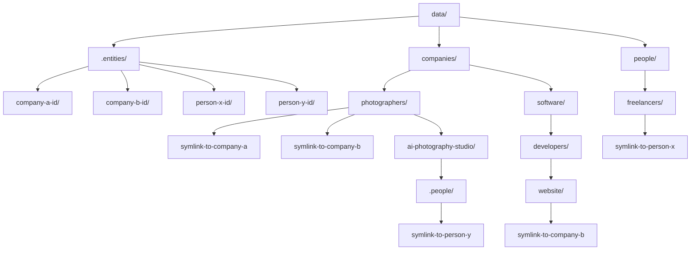

# Architectural Decision Record: Hierarchical Entity Data with Symlinks

## 1. Context and Problem Statement

Currently, all company data is stored in a flat directory structure under `~/.local/share/data/companies/`. Each company resides in its own directory directly within this top-level `companies/` folder. Similarly, person data is likely stored in a flat `people/` directory. While simple, this approach becomes unmanageable as the number of entities (companies and people) grows and as the need for categorization and flexible relationships arises.

The primary issues are:
*   **Lack of Categorization:** No inherent way to group entities by industry, type, or any other criteria.
*   **Duplication Problem:** If an entity belongs to multiple categories, storing its data in multiple places leads to duplication and inconsistency.
*   **Cross-Categorization Problem:** Difficulty in managing entities that fit into more than one category without duplicating data.
*   **Limited Contextual Operations:** Inability to easily scope operations (e.g., search, view meetings) to a specific subset of entities based on a category.
*   **Rigid Relationships:** Difficulty in establishing flexible relationships between entities (e.g., a person working for a company) without data duplication.

The goal is to introduce a flexible, hierarchical categorization system that avoids data duplication, supports context-based operations, and allows for dynamic relationships between companies and people, enabling users to focus on specific subsets of entities.

## 2. Proposed Solution: Canonical Storage with Symlinked Categories

The proposed solution involves a two-tiered file system structure directly under the `data/` directory:

1.  **Canonical Storage (`.entities/`):** Each entity (company or person) will be stored in a unique, stable directory under a hidden `.entities/` directory, which is a direct child of the `data/` path. The directory name will be a unique identifier for the entity. This directory will be the single source of truth for all entity-related files.

    *   **Example Path:** `~/.local/share/data/.entities/company-a-unique-id/`
    *   **Example Path:** `~/.local/share/data/.entities/person-x-unique-id/`
    *   The specific strategy for generating these unique identifiers (e.g., slug-based, hash-based, or a combination) will be detailed in a separate ADR: "Canonical Entity Identification".

2.  **Categorization Layer (`companies/` and `people/`):** The `companies/` and `people/` directories will now house the arbitrary hierarchical folder structures for categorization. Within these structures, symbolic links (symlinks) will point to the canonical entity directories in `.entities/`. An entity can be part of multiple categories by having multiple symlinks pointing to its canonical directory.

    *   **Example Company Paths:**
        *   `~/.local/share/data/companies/photographers/symlink-to-company-a/`
        *   `~/.local/share/data/companies/software/developers/website/symlink-to-company-b/`
    *   **Example Person Paths:**
        *   `~/.local/share/data/people/freelancers/symlink-to-person-x/`
        *   `~/.local/share/data/companies/photographers/ai-photography-studio/.people/symlink-to-person-y/` (linking a person to a company)

### Visual Representation of Proposed Structure:

## 3. Possible Concerns

*   **Complexity of File System Operations:** Managing symlinks (creation, deletion, resolution) adds complexity to file system interactions within the application.
*   **Broken Symlinks:** If a canonical entity directory is moved or deleted without updating its symlinks, it could lead to broken links and application errors.
*   **Performance:** Recursively traversing the category structure and resolving symlinks might introduce a performance overhead, especially with a very deep hierarchy or a large number of entities/categories. This concern is further elaborated in the "Canonical Entity Identification" ADR.
*   **User Education:** Users will need to understand the concept of canonical storage and symlinked categories, and how to manage them via CLI commands.
*   **Operating System Compatibility:** While symlinks are widely supported, subtle differences in behavior across OS (Windows vs. Unix-like) might need consideration, though Python's `pathlib` generally abstracts this well.
*   **Canonical ID Strategy:** The choice of canonical ID (e.g., slug, hash, UUID) needs careful consideration to avoid accidental duplication, handle name changes, and manage entities with multiple branches or similar names. This will be explored in a dedicated ADR.

## 4. Optimal Implementations

### A. Core Data Retrieval Logic (`_get_all_searchable_items` modification)

The current `_get_all_searchable_items()` function in `cocli/core/utils.py` iterates only through immediate subdirectories. This needs to be updated to:

1.  **Recursive Traversal:** Implement a recursive function to traverse the `companies/` and `people/` directories (excluding `.entities/`).
2.  **Symlink Resolution:** For each entry found, check if it's a symlink. If it is, resolve it to its target path in `.entities/`.
3.  **Uniqueness:** Store resolved canonical paths in a set to ensure each entity is processed only once, even if it has multiple symlinks.
4.  **Entity Object Creation:** From the unique canonical paths, load the `Company` or `Person` objects.

### B. Context Setting Mechanism

A new CLI command, e.g., `cocli campaign set`, would manage the active context.

*   **`cocli campaign set <campaign_name>`:** Sets the current working context to a specific campaign. The context would be stored in a configuration file (e.g., `cocli_config.toml` or a dedicated `context.toml`).
*   **`cocli context clear`:** Clears the active context, reverting to searching all entities.
*   **`cocli context show`:** Displays the current active context.

When a context is active, all entity-related commands (e.g., `view`, `add-meeting`, `enrich`, `fz`) would modify their data retrieval logic to only consider entities whose symlinks exist within the active context path.

### C. Entity Creation/Management

*   **`cocli add company <name> --category <path>`:** When adding a new company, the application would:
    1.  Create the canonical company directory in `.entities/` with a unique identifier.
    2.  Create a symlink to this canonical directory within the specified category path (e.g., `companies/photographers/`).
*   **`cocli add person <name> --category <path>`:** Similar to companies, but for persons.
*   **`cocli move entity <name> --to-category <path>`:** This would involve deleting existing symlinks and creating new ones in the target category.
*   **`cocli link entity <name> --to-category <path>`:** Creates an additional symlink for an existing entity in a new category.
*   **`cocli link person <person_name> --to-company <company_name>`:** Creates a symlink to the canonical person entity within the `.people/` subdirectory of the specified company's category folder (e.g., `companies/photographers/ai-photography-studio/.people/symlink-to-person-y/`).

## 5. Existing Tools that Could Assist

*   **Python's `pathlib` module:**
    *   `Path.iterdir()`: For iterating directory contents.
    *   `Path.is_dir()`, `Path.is_file()`, `Path.is_symlink()`: For checking file system entry types.
    *   `Path.resolve()`: For resolving symlinks to their canonical paths.
    *   `Path.mkdir(parents=True, exist_ok=True)`: For creating directories.
*   **Python's `os` module:**
    *   `os.symlink(source, link_name)`: For creating symbolic links.
    *   `os.unlink(path)`: For deleting files (including symlinks).
*   **`typer` (already in use):** For building a user-friendly and robust command-line interface for managing categories and context.
*   **`tomli`/`tomli_w` (already in use):** For reading and writing configuration files (e.g., for storing the active context).

## 6. Canonical Entity Identification

The strategy for generating and managing the unique identifiers for canonical entity directories within `.entities/` is a critical aspect that requires further detailed discussion. This includes addressing scenarios such as handling entities with identical or very similar names, managing name changes, supporting entities with multiple branches or locations, ensuring uniqueness, and avoiding accidental duplication.

For a comprehensive discussion on these issues and proposed solutions, please refer to the dedicated Architectural Decision Record: [Canonical Entity Identification](adr/canonical-entity-id/_index.md).