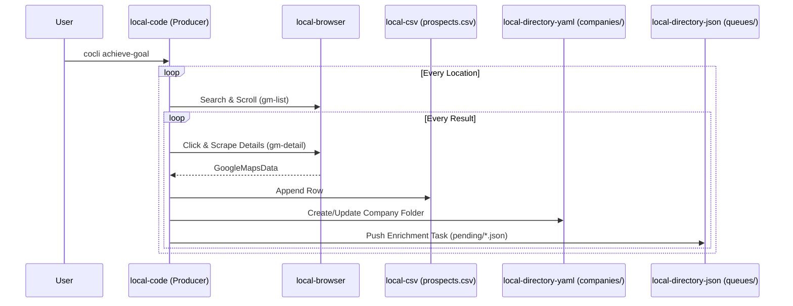
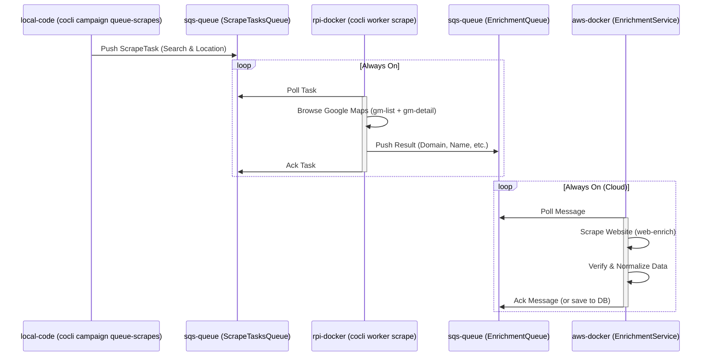
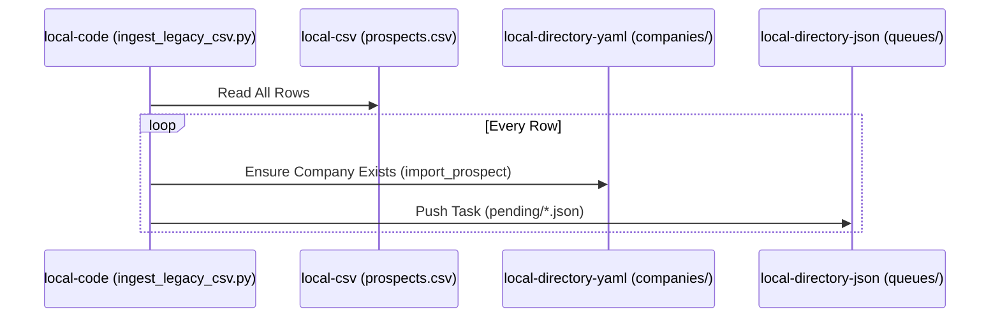
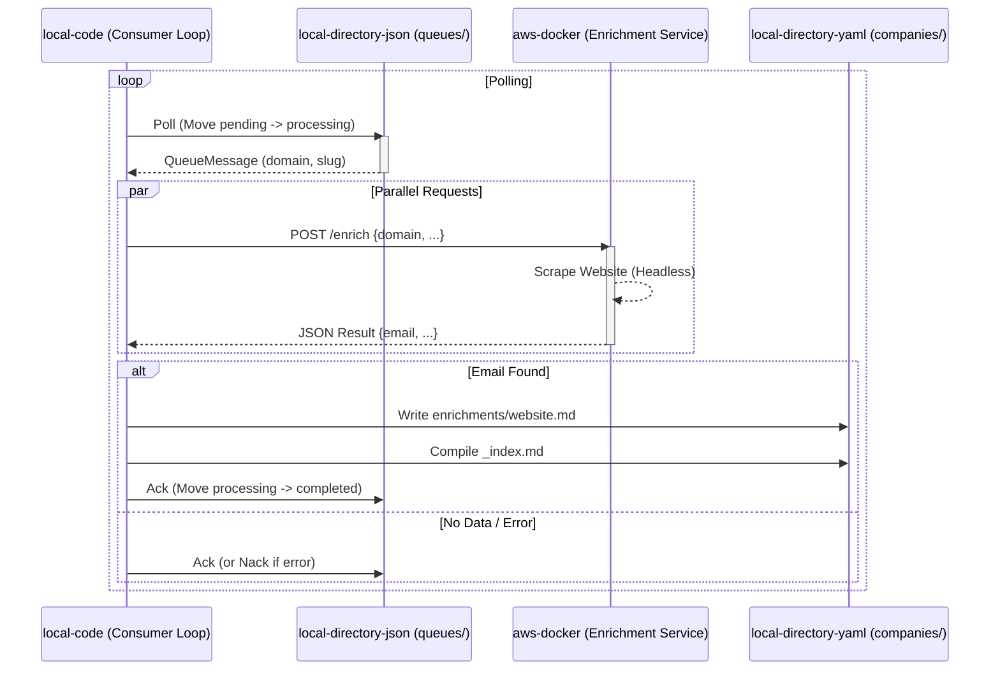

# System Architecture & Data Flow Map

This document defines the standardized nomenclature for the physical execution domains, data storage types, and process phases of the `cocli` system. It also maps the current data flows using this terminology.

## Nomenclature

### Process Phases
These terms define the logical stages of data acquisition.

| Phase | Description |
| :--- | :--- |
| **`gm-list`** | **Google Maps List Discovery.** Initial scraping of the search results sidebar. Captures basic info (Name, Partial Address, Place ID) but no deep details. |
| **`gm-detail`** | **Google Maps Detail Extraction.** Navigating to a specific Place ID/Result to extract full metadata (Website, Phone, Full Address, Hours). |
| **`web-enrich`** | **Website Enrichment.** Visiting the company's website (found in `gm-detail`) to scrape emails, social links, and contacts. |

### Execution Domains
These terms define *where* the code is running.

| Domain | Description |
| :--- | :--- |
| **`local-code`** | The `cocli` Python application running on the user's local machine (Laptop/Workstation). |
| **`local-browser`** | The Playwright browser instance running on the user's local machine (Headless or Headed). |
| **`rpi-docker`** | The Scraper Worker running as a Docker container on a Raspberry Pi (`cocli-worker-rpi`). |
| **`aws-docker`** | The Enrichment Service running as a Docker container in AWS Fargate. |
| **`aws-lambda`** | (Future) Serverless functions for discrete tasks. |

### Data Storage Types
These terms define the format and location of data persistence.

| Storage Type | Example Path/Usage |
| :--- | :--- |
| **`local-csv`** | Flat files for tabular data.   *Ex: `scraped_data/<campaign>/prospects/prospects.csv`* |
| **`local-directory-yaml`** | Structured data where each record is a folder containing YAML frontmatter files.   *Ex: `companies/<slug>/_index.md`* |
| **`local-directory-json`** | Local queue system storage (legacy/dev).   *Ex: `queues/<queue_name>/pending/*.json`* |
| **`sqs-queue`** | AWS Simple Queue Service for distributed task management.   *Ex: `ScrapeTasksQueue`, `EnrichmentQueue`* |
| **`remote-object-storage`** | (Future) S3 Buckets for backup or shared state. |

---

## Data Flow Diagrams

### 1. Standard Prospecting Flow (Legacy Local `achieve-goal`)
This flow combines `gm-list` and `gm-detail` into a single synchronous loop, then queues for `web-enrich`.

### 2. Distributed Scraping Flow (Current Architecture)
This flow decouples the scraping and enrichment into distributed components using AWS SQS.

### 3. Legacy Migration Flow (`ingest-legacy`)
This flow migrates existing `local-csv` data into the `local-directory-json` queue to backfill the enrichment process.

### 4. Hybrid Enrichment Flow (`enrich-from-queue`)
This flow consumes tasks from the local queue, processes them via the remote Fargate service, and saves results locally.

