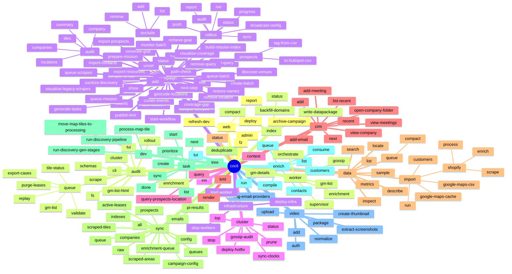

# CLI Target Command Tree & Consolidation Design

This document details the target command tree, design decisions, consolidation mapping, and deprecation policy for the CLI Consolidation Epic (Phase 2). 

The machine-checkable done-condition for this epic's refactoring is when `diff docs/cli/actual_tree.txt docs/cli/target_tree.txt` is empty.

---

## 1. Rationale & Architecture

To address the sprawling command namespace of the legacy CRM, we consolidate the command structure from over 40 root commands/groups down to 24 root entry points. This redesign groups commands by their domain entity/workflow context, removes redundant sync surfaces, and enforces consistent naming patterns.

### The 6 Overlap Clusters Resolution
1. **Sync vs. Smart-Sync vs. Rollout Config**:
   - **`cocli smart-sync`** and its subcommands are completely merged into **`cocli sync`**. Subcommands like `smart-sync all` become `sync all`, and `smart-sync scraped-areas` becomes `sync scraped-areas`.
   - Campaign configuration push/pull actions (`campaign rollout push-config` and `campaign rollout pull-config`) are merged into `cocli sync config --direction [push|pull]`.
2. **Audit Splitting (System vs. Campaign)**:
   - **`cocli audit`**: Reserved for code, system, configuration, cluster, and infrastructure auditing (e.g., `audit cli`, `audit fs`, `audit schemas`, `audit cluster`).
   - **`cocli campaign audit`**: Dedicated to campaign data and scraping progress (e.g., `campaign audit companies`, `campaign audit tiles`).
3. **Enrichment Entry Points**:
   - Consolidated under a single **`cocli enrich`** group. This merges `enrich-customers` into `enrich customers`, `compile-enrichment` into `enrich compile`, `campaign queue-enrichment` into `enrich queue`, and `campaign prospects enrich-from-queue` into `enrich consume`.
4. **Data Import Consolidation**:
   - Consolidated under **`cocli data import`**. This replaces verbose root imports (`import-customers`, `google-maps-cache-to-company-files`, etc.). Additionally, Shopify legacy commands are grouped under `cocli data import shopify`.
5. **Infrastructure Boundaries**:
   - **`cocli infrastructure`**: Manages cloud backend AWS / CDK resources.
   - **`cocli cluster`**: Manages edge Raspberry Pi worker nodes (Docker, gossip, sync clocks, health).
   - **`cocli worker`**: Daemon entry points for cluster execution.
   - **`cocli dev`**: Development utilities/pipelines for local testing.
6. **CRM Verbs Grouping**:
   - CRM-like operations are placed under a unified **`cocli crm`** namespace (e.g., `crm add`, `crm view-company`, `crm list-recent`). Interactive user shortcuts `fz`, `next`, and `recent` stay as top-level helpers but map canonically to `crm` endpoints.

---

## 2. Campaign Group Namespace Design

To resolve the seven-way flattening in `campaign/__init__.py` using `name=""`, we adopt **Explicit Flat Membership**:
- All campaign sub-apps (`mgmt`, `workflow`, `planning`, `viz`, `prospecting`, `curation`) are registered directly onto the main `campaign` Typer app.
- This avoids the implicit `name=""` hack that bypasses Typer's subcommand structure, while maintaining a single, flat flat membership layer for user execution.
- We defer structural name modifications of stable campaign commands (e.g. `campaign prepare-mission`) to Phase 3-final.

---

## 3. Canonical Service Layer: `cocli/application/`

We select **`cocli/application/`** as the canonical orchestration layer (the **Application API**) for Phase 4 & Phase 5 logic extraction.

*   **Fate of `cocli/application/`**: Receives all domain/orchestration services extracted from command modules. Commands should act as thin adapters, delegating validation, I/O, and business transactions to these services.
*   **Fate of `cocli/services/`**: Reserved exclusively for low-level technical infrastructure drivers (e.g., SSH clients, Docker managers, local WAL logs, S3 bucket drivers). It does not contain domain workflows or business-driven operations.

---

## 4. Mermaid Target Command Tree Visualization

---

## 5. Command Mapping Matrix

| Old Command | New Command | Epic Phase | Automation Callers / Impact | Disposition Rationale |
| :--- | :--- | :--- | :--- | :--- |
| `cocli add` | `cocli crm add` | Phase 3-final | None | Grouped into unified `crm` namespace. |
| `cocli add-email` | `cocli crm add-email` | Phase 3-final | None | Grouped into unified `crm` namespace. |
| `cocli add-meeting` | `cocli crm add-meeting` | Phase 3-final | None | Grouped into unified `crm` namespace. |
| `cocli view-company` | `cocli crm view-company` | Phase 3-final | None | Grouped into unified `crm` namespace. |
| `cocli view-meetings` | `cocli crm view-meetings` | Phase 3-final | None | Grouped into unified `crm` namespace. |
| `cocli open-company-folder` | `cocli crm open-company-folder` | Phase 3-final | None | Grouped into unified `crm` namespace. |
| `cocli next` | `cocli crm next` | Phase 3-final | None | Grouped into unified `crm` namespace. |
| `cocli recent` | `cocli crm recent` | Phase 3-final | None | Grouped into unified `crm` namespace. |
| `cocli companies list-recent` | `cocli crm list-recent` | Phase 3-final | None | Grouped into unified `crm` namespace; original group dropped. |
| `cocli import-data` | `cocli data import run` | Phase 5 | `launch.json:114` | Consolidation of imports under `data import`. |
| `cocli import-customers` | `cocli data import customers` | Phase 5 | None | Consolidation of imports under `data import`. |
| `cocli google-maps-cache-to-company-files` | `cocli data import google-maps-cache` | Phase 5 | None | Consolidation of imports under `data import`. |
| `cocli google-maps-csv-to-google-maps-cache` | `cocli data import google-maps-csv` | Phase 5 | None | Consolidation of imports under `data import`. |
| `cocli scrape-shopify-myip` | `cocli data import shopify scrape` | Phase 5 | `launch.json:140` | Grouped legacy Shopify data commands. |
| `cocli process-shopify-scrapes` | `cocli data import shopify process` | Phase 5 | None | Grouped legacy Shopify data commands. |
| `cocli enrich-shopify-data` | `cocli data import shopify enrich` | Phase 5 | `launch.json:154` | Grouped legacy Shopify data commands. |
| `cocli enrich-customers` | `cocli enrich customers` | Phase 4 | None | Consolidates all enrichments under `enrich` namespace. |
| `cocli compile-enrichment` | `cocli enrich compile` | Phase 4 | None | Consolidates all enrichments under `enrich` namespace. |
| `cocli campaign queue-enrichment` | `cocli enrich queue` | Phase 4 | None | Moves campaign-specific enrichment queueing to `enrich`. |
| `cocli campaign prospects enrich-from-queue` | `cocli enrich consume` | Phase 4 | `launch.json:70` | Moves campaign prospects queue consumption to `enrich`. |
| `cocli exclude` (root) | `cocli campaign exclude` | Phase 3 | None | Removed root-level duplication. Canonical campaign location stays. |
| `cocli smart-sync <cmd>` | `cocli sync <cmd>` | Phase 5 | None | Removes redundant `smart-sync` surface in favor of `sync`. |
| `cocli campaign rollout push-config` | `cocli sync config --direction push` | Phase 5 | None | Merged duplicate campaign rollout config sync into `sync config`. |
| `cocli campaign rollout pull-config` | `cocli sync config --direction pull` | Phase 5 | None | Merged duplicate campaign rollout config sync into `sync config`. |
| `cocli campaign upload-kml-coverage` | `cocli campaign publish-kml` | Phase 3 | None | Dropped legacy command; maps to campaign publish-kml. |
| `cocli render-prospects-kml` | `cocli render kml` | Phase 5 | None | Merges prospects KML rendering into standard `render kml`. |
| `cocli render kml-coverage` | `cocli render kml` | Phase 5 | None | Merges turboship coverage rendering into standard `render kml`. |

---

## 6. Deprecation Policy

To prevent breaking active pipelines, scripts, and developer configurations, we enforce the following deprecation guidelines:

1.  **Bake Period**: All deprecated commands must remain functional as hidden aliases for at least **2 minor versions** (e.g., if deprecated in `0.5.0`, they will be removed in `0.7.0`).
2.  **Alias Implementation**: Deprecated entry points must be configured in Typer with `hidden=True` so they do not show in the standard `--help` outputs but still resolve upon execution.
3.  **Warning Messages**: Upon invocation, deprecated commands must print a clear one-line deprecation notice to `sys.stderr` and exit with the output of the redirected target command.
    *   *Format*: `DEPRECATION WARNING: 'cocli {old_name}' is deprecated and will be removed in version {removal_version}. Use 'cocli {new_name}' instead.`
4.  **Automation Safety**: Commands identified with automation callers (such as `launch.json` or cluster deployment helper scripts) must not have their signatures modified during the bake period.
