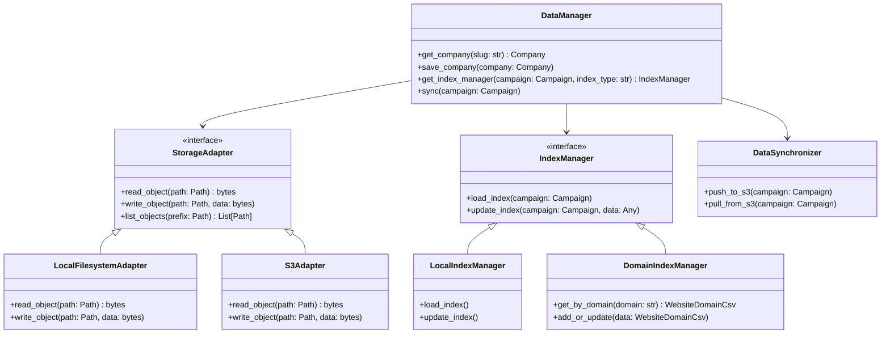

# Intelligent Data Manager Design

## Objective

To provide a unified, flexible, and robust data management layer for `cocli` that abstracts storage mechanisms (local filesystem, S3), intelligently handles various data types (Pydantic models, CSVs, Markdown), and facilitates synchronization between local and cloud environments, especially for campaign-specific data and indexes. This design aims to support both local development and cloud deployments (e.g., EC2, Fargate) with data persistence and scalability.

## Related Documentation

*   [S3 Integration Sequence Diagram](./s3-integration-sequence.md)
*   [ADR 012: Distributed Filesystem Index (DFI)](../adr/012-distributed-filesystem-index/README.md)

## Core Principles

*   **Storage Abstraction:** Consumers of the data manager should not need to know the underlying storage mechanism (local file, S3 object, database entry).
*   **Data Type Awareness (Pydantic First):** All data persisted by `cocli` must be defined by a Pydantic model. This includes data stored as CSVs (e.g., `GoogleMapsData`), JSON, or Markdown.
    *   **1-to-1 Mapping:** There should be a strict 1-to-1 mapping between the storage format and its corresponding Pydantic model. For example, a row in `prospects.csv` must map exactly to a `GoogleMapsDataCSV` model (or similar).
    *   **Explicit Transformation:** Any transformation between models (e.g., from a raw scraped `GoogleMapsData` to a `Company` record) must be explicit and handled by a transformation service, not implicitly by the storage layer.
*   **Intelligent Caching/Indexing:** Optimize access patterns by maintaining local caches/indexes while ensuring eventual consistency with remote stores.
*   **Pluggable Storage Backends:** Allow easy extension to support new storage types (e.g., databases, other cloud storage).
*   **Campaign-Centric:** Operations are often scoped to a specific campaign, allowing for isolated data management.

## Architecture Diagrams

### Class Diagram (Mermaid)



### Data Flow Diagram (Mermaid)

```mermaid
flowchart TD
    subgraph "Local Environment"
        CLI[cocli CLI]
        LocalFS["Local Filesystem (data)"]
        LocalIndex["Local Index (CSVs)"]
    end

    subgraph "Cloud Environment (AWS)"
        S3Bucket["S3 Bucket (cocli-data-turboship)"]
        S3Index["S3 Index Objects (JSON)"]
    end

    subgraph "Services"
        Scraper[Google Maps Scraper]
        Enricher[Website Enrichment Service]
    end

    %% Local Workflow
    CLI -->|1. Scrape| Scraper
    Scraper -->|2. Save Raw Data| LocalFS
    CLI -->|3. Enrich| Enricher
    
    %% S3 Integration (Enrichment)
    Enricher -->|4. Check/Update Index| DomainIndexManager
    DomainIndexManager -->|5. Get/Put Object| S3Index

    %% Synchronization
    CLI -->|6. Sync (Push/Pull)| DataSynchronizer
    DataSynchronizer -->|7. Read/Write| LocalFS
    DataSynchronizer -->|8. Put/Get Object| S3Bucket
```

## Key Components

### 1. `DataManager` (Singleton/Facade)

*   **Role:** The primary entry point for all data operations within `cocli`. It acts as a facade, delegating requests to appropriate `StorageAdapters` and `IndexManagers`.
*   **Responsibilities:**
    *   Manages global configuration (e.g., `COCLI_DATA_HOME`, AWS profile, S3 bucket names).
    *   Initializes and provides access to `StorageAdapter` and `IndexManager` instances based on configuration.
    *   Provides high-level methods for common data operations (e.g., `get_company(slug)`, `save_company(company)`, `get_campaign_index(campaign, index_type)`).
    *   Orchestrates data synchronization via `DataSynchronizer`.

### 2. `StorageAdapter` (Interface/Abstract Base Class)

*   **Role:** Defines a common interface for interacting with different storage backends for raw data objects (e.g., company Markdown files, scraped CSVs).
*   **Interface Methods (Examples):**
    *   `read_object(path: Path) -> bytes`
    *   `write_object(path: Path, data: bytes) -> None`
    *   `list_objects(prefix: Path) -> List[Path]`
    *   `delete_object(path: Path) -> None`
    *   `get_metadata(path: Path) -> Dict[str, Any]` (e.g., S3 object tags)
*   **Concrete Implementations:**
    *   **`LocalFilesystemAdapter`:** Handles operations on the local `COCLI_DATA_HOME` directory.
    *   **`S3Adapter`:** Handles operations on an S3 bucket using `boto3`. It will manage S3 object keys corresponding to file paths.

### 3. `IndexManager` (Interface/Abstract Base Class)

*   **Role:** Defines a common interface for managing campaign-specific indexes (e.g., `WebsiteDomainCsvManager`, `LocationProspectsIndex`). These indexes are typically structured text files (CSV, JSON) that provide fast lookups for aggregated data.
*   **Interface Methods (Examples):**
    *   `load_index(campaign: Campaign) -> Any`
    *   `update_index(campaign: Campaign, data: Any) -> None`
    *   `get_entry(campaign: Campaign, key: str) -> Optional[Any]`
    *   `list_entries(campaign: Campaign) -> List[Any]`
*   **Concrete Implementations:**
    *   **`LocalIndexManager`:** Manages indexes stored on the local filesystem (e.g., CSVs in `data/indexes/`).
    *   **`S3IndexManager` (New - e.g., `DomainIndexManager`):** Manages indexes stored in S3.
        *   **Strategy: Manifest-Pointer (Distributed Snapshot):**
            *   **CAS Shards:** Data is stored in immutable shards at `indexes/shards/`.
            *   **Manifests:** A versioned map at `indexes/manifests/` tracks which shard contains which domain.
            *   **Atomic Swaps:** A `LATEST` pointer is updated to commit batches of changes.
            *   **Benefits:** Zero S3 `LIST` calls required; DuckDB can query the entire index in seconds by reading the manifest.

### 4. `DataSynchronizer` (New Utility)

*   **Role:** Responsible for synchronizing data between a `LocalFilesystemAdapter` and an `S3Adapter`.
*   **Responsibilities:**
    *   **Push to S3:** Uploads local changes (new files, updated files) to S3.
    *   **Pull from S3:** Downloads remote changes from S3 to the local filesystem.
    *   **Conflict Resolution:** Implements strategies for handling conflicts (e.g., last-write-wins, or more sophisticated logic based on data types and timestamps).
    *   **Filtering:** Allows specifying path patterns or data types for selective synchronization.
*   **Integration:** Can be invoked as a `cocli` command (e.g., `cocli sync campaign <campaign_name> --direction push/pull`), or integrated into `DataManager` lifecycle hooks.

### 5. Dual Index Strategy

To balance the need for massive write concurrency (cloud workers) with fast read access (CLI search), we employ two distinct index types:

*   **Coordination Index (Write-Optimized):**
    *   **Format:** Content-Addressable USV Shards + Atomic Manifest.
    *   **Location:** `s3://bucket/indexes/shards/` and `s3://bucket/indexes/manifests/`.
    *   **Purpose:** Massive write concurrency with instant read-consistency via Manifest Swaps.
    *   **Primary User:** Fargate/RPi workers, DuckDB Query Engine.

*   **Search Index (Read-Optimized):**
    *   **Format:** Local DuckDB Cache / `domains_master.csv`.
    *   **Location:** S3 (synced to local cache).
    *   **Purpose:** Extremely fast local searching (`cocli fz`, `rg`) and bulk reporting.
    *   **Primary User:** CLI users, analysts.

### 6. `IndexConsolidator` (New Utility)

*   **Role:** Bridges the gap between the Coordination Index and the Search Index.
*   **Responsibilities:**
    *   Periodically scans the Coordination Index (S3 objects).
    *   Aggregates the data into a single Search Index CSV.
    *   Uploads the updated CSV to S3 for distribution.
*   **Execution:** Can be run as a scheduled Lambda function or a batch job at the end of a scraping run.

## Data Flow & Interaction

### Local Development Workflow

1.  `cocli` commands (e.g., `achieve-goal`) interact with the `DataManager`.
2.  `DataManager` primarily uses `LocalFilesystemAdapter` and `LocalIndexManager` for fast local access.
3.  When a campaign is configured with `aws_profile_name` and an S3 bucket, the `DataManager` can be configured to use `S3Adapter` and `S3IndexManager` for specific operations or for synchronization.
4.  A `cocli sync` command (powered by `DataSynchronizer`) is used to explicitly push local `data/` changes to S3 or pull remote changes.

### Cloud Deployment Workflow (EC2/Fargate)

1.  `cocli` application instances (e.g., enrichment service on Fargate, Google Maps scraper on EC2) are configured with `COCLI_DATA_HOME` pointing to a local mount point (e.g., `/mnt/data`).
2.  The `DataManager` on these instances is configured to use `S3Adapter` and `S3IndexManager` as the primary storage for critical data and indexes.
3.  A `cron` job or similar mechanism on EC2 instances (or within Fargate tasks) periodically runs `aws s3 sync` to keep the local mount point synchronized with the S3 bucket for bulk data (e.g., company Markdown files).
4.  The `S3IndexManager` (e.g., `DomainIndexManager`) directly interacts with S3 for its index operations, ensuring consistency across distributed services.

## Example: `achieve-goal` with S3 Integration

1.  `cocli campaign achieve-goal turboship --emails 10`
2.  `DataManager` is initialized. It detects `aws_profile_name` in the `turboship` campaign config and initializes an `S3Adapter` and `S3IndexManager` for domain indexing.
3.  **Pre-Scrape Sync (Optional but Recommended):** `DataSynchronizer` pulls relevant campaign data (e.g., existing company files) and indexes from S3 to the local `COCLI_DATA_HOME` to ensure the local environment is up-to-date.
4.  Google Maps scraper runs, writing new prospects to local `data/scraped_data/turboship/prospects.csv`.
5.  For each prospect, the website enrichment service (running locally in Docker) uses the `S3IndexManager` to check/update domain status directly in S3. This ensures that the global domain index is immediately updated and visible to other potential services.
6.  After `achieve-goal` completes, `DataSynchronizer` pushes all local changes (new prospects CSV, updated company Markdown files) to S3.

## Benefits

*   **Decoupling:** Separates data access logic from business logic, making components more independent.
*   **Scalability:** Leverages S3 for highly scalable and durable storage of raw data and indexes.
*   **Resilience:** Data is persisted in S3, making compute instances (EC2, Fargate) ephemeral and easily replaceable.
*   **Flexibility:** Easy to switch between local filesystem and S3-backed operations, and to extend with new storage types.
*   **Clearer Data Flow:** Explicit synchronization steps and well-defined interfaces for data interaction.
*   **Incremental Adoption:** Allows for gradual migration of data management to S3 without a complete rewrite.

This design provides a comprehensive roadmap for building the intelligent data manager, addressing the complexities of S3 integration and preparing `cocli` for robust cloud deployment.
