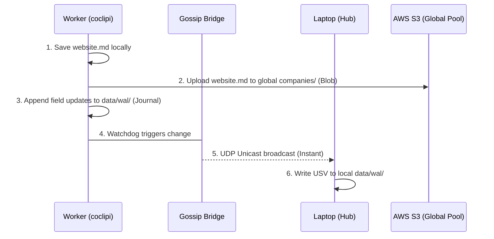
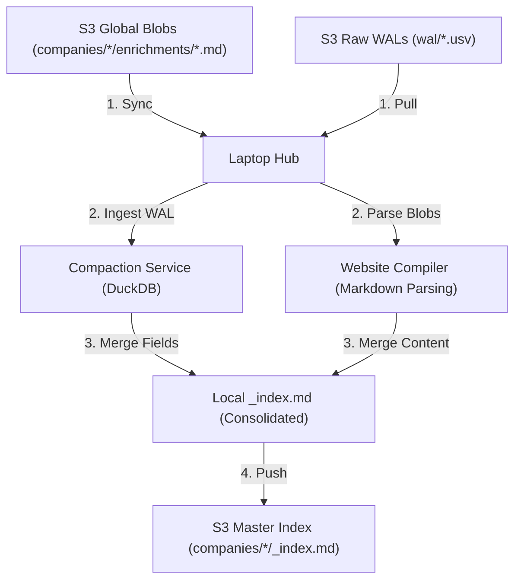

# Distributed Data Update Propagation

## Overview
This document describes the **Tiered Distributed Data Paradigm** implemented in `cocli`. This system handles high-availability scraping and real-time coordination across a heterogeneous cluster (Raspberry Pi nodes, cloud workers, and laptop hubs) while ensuring eventual consistency via S3.

## 1. The Tiered Strategy

The system prioritizes local, sub-second coordination while maintaining a durable, consolidated cloud record.

### Tier 1: Real-Time Gossip (Unicast UDP)
- **Mechanism**: UDP Unicast datagrams (Port 9999).
- **Discovery**: Triple-layered (mDNS, Static Config, Hardcoded Fallbacks).
- **Networking**: Containers use `--network host`.
- **Storage**: Centralized Journaling in `data/wal/{YYYYMMDD}_{node_id}.usv`.
- **Scope**: Used for **Mutable Field State** (phone, email, tags, last_enriched).
- **Conflict Resolution**: **Last-Write-Wins (LWW)** based on ISO-8601 timestamps.

### Tier 2: Large-Blob Durability (Worker -> S3)
- **Mechanism**: Worker nodes upload large, structured results directly to S3.
- **Path**: `s3://{bucket}/companies/{slug}/enrichments/{source}.md` (GLOBAL SHARED)
- **Scope**: Used for **Large Results** (website scrape dumps, head.html).
- **Consolidation**: Propagated via `aws s3 sync` to the Hub for local compilation.

### Tier 3: Consolidation & Hub Compaction (Hub -> S3)
- **Mechanism**: The **Laptop Hub** node pulls raw datagrams and blobs, merges them into monolithic `_index.md` files (FIMC pattern).
- **Persistence**: Hub uploads consolidated `_index.md` back to S3.
- **Shared Data**: Companies and People are stored at the S3 root (non-namespaced) to ensure cross-campaign accessibility.

---

## 2. Architecture Diagrams

### 2.1 Standard Update Propagation
When a worker (e.g., `coclipi`) completes a scrape:

### 2.2 Hub Compaction & Master Update
Periodically, the Hub node consolidates the cluster's work:

---

## 3. Scenarios & Conflict Resolution

### Scenario A: Real-time Coordination
Worker A and Worker B update different fields for the same company (e.g., `phone` and `email`).
- **Resolution**: Both broadcast datagrams. Both nodes receive both updates and apply them to their local state.

### Scenario B: Field-Level Collision
Worker A and Worker B both find different `website_url` values for the same company at the same time.
- **Resolution**: **Last-Write-Wins (LWW)**. During compaction, the record with the latest ISO-8601 timestamp in the USV datagram wins.

### Scenario C: Laptop Catch-up
The laptop has been offline for 4 hours while the Pi cluster continued working.
1. **Sync**: Laptop runs `aws s3 sync s3://{bucket}/wal/ data/wal/`.
2. **Replay**: Laptop runs `compact_all_companies()`. 
3. **Reconnect**: Laptop rejoins the Gossip Bridge and starts receiving real-time updates again.

---

## 4. Implementation Details

- **USV Format**: `timestamp|node_id|target|field|value|causality` (using `\x1f` and `\x1e`).
- **Location**: `companies/{slug}/updates/{YYYYMMDD}_{node_id}.usv`.
- **Deduplication**: Handled by the `DatagramRecord` logic using field-level granularity.
