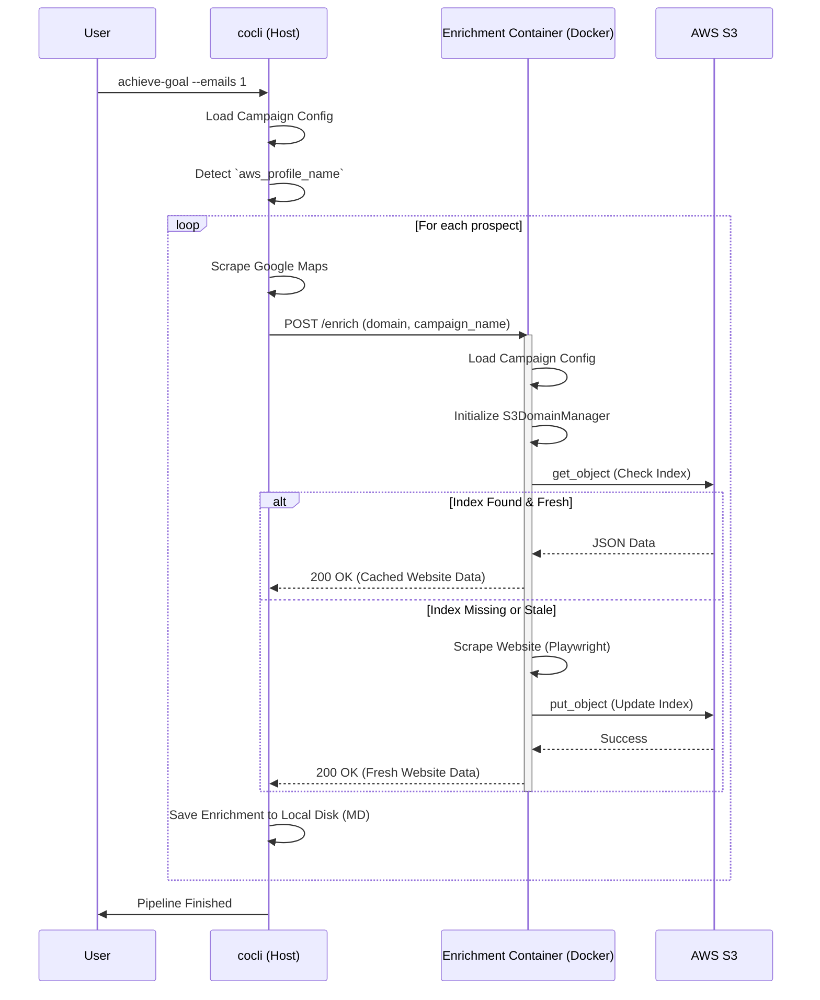

# S3 Integration Sequence

This document details the sequence of interactions when running the `achieve-goal` command with S3 integration enabled (Local Development Mode).

## Sequence Diagram



## Configuration Note: Local Development with Docker

When running this flow locally, the Docker container must have access to AWS credentials to authenticate with S3. We achieve this by mounting the host's `~/.aws` directory into the container.

**Makefile Configuration:**

```makefile
start-enricher: ## Start docker enrichment service
    @docker run --rm -d \
        -p 8000:8000 \
        --name cocli-enrichment \
        -e LOCAL_DEV=1 \
        -v $(HOME)/.aws:/root/.aws:ro \
        enrichment-service
```

*   `-e LOCAL_DEV=1`: Tells the service to skip 1Password retrieval and look for standard AWS credentials.
*   `-v $(HOME)/.aws:/root/.aws:ro`: Mounts the host's AWS credentials to the container's root user directory (read-only).
