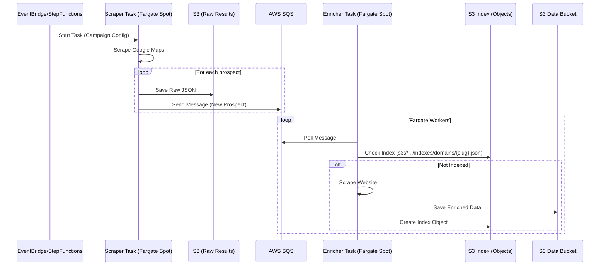

# Scenario: Cloud Native ETL

This scenario represents the fully automated, serverless-like production workflow. Both scraping and enrichment run on AWS Fargate Spot instances, orchestrated by AWS Step Functions or EventBridge.

## Description

1.  **Trigger:** A schedule (Cron) or event triggers the workflow.
2.  **Cloud Scrape:** A Fargate task runs the Google Maps scraper (headless).
3.  **Pipeline:** Found prospects are streamed to SQS or an intermediate S3 bucket.
4.  **Cloud Enrich:** Fargate workers enrich the prospects.
5.  **Persistence:** All data is born and lives in S3.

## Sequence Diagram

## Data Persistence

*   **Google Maps Results:** Stored as **Individual S3 Objects** (e.g., `s3://.../scrapes/{id}.json`) or appended to a Kinesis stream. This avoids the complexity of managing a single CSV file from a distributed scraper.
*   **Indexes:** **Object-per-Record** in S3 for both Domains and Google Maps Place IDs.
    *   `indexes/places/{place_id}.json`
    *   `indexes/domains/{domain}.json`
*   **Enriched Data:** Stored in S3.
*   **Cost Optimization:** Using Fargate Spot for all tasks ensures minimal cost for transient compute.
