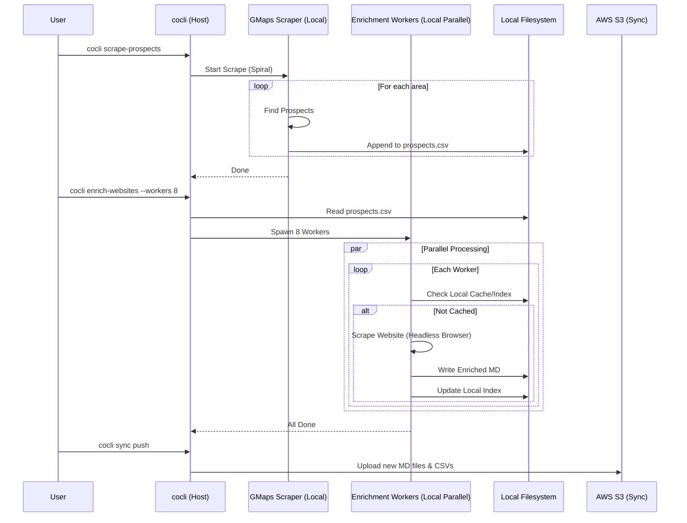

# Scenario: Local Parallel ETL

This scenario represents the standard, high-throughput local development workflow. It is optimized for speed by leveraging parallel processing on the local machine.

## Description

In this mode, the user separates the scraping and enrichment phases to allow for bulk processing.
1.  **Batch Scrape:** The user runs a scrape command to gather a large list of raw prospects.
2.  **Parallel Enrich:** The user runs an enrichment command that spins up multiple local workers (processes/containers) to process the list in parallel.

## Sequence Diagram

## Data Persistence

*   **Raw Data:** Stored in `data/scraped_data/<campaign>/prospects/prospects.csv`.
*   **Enriched Data:** Stored as Markdown files in `data/companies/<slug>/enrichments/website.md`.
*   **Indexes:** Local CSV files (`website-domains.csv`) are used to track status and avoid re-work.
*   **S3 Role:** S3 acts as a backup/sync target. Data is pushed to S3 *after* processing for safe keeping or sharing.
