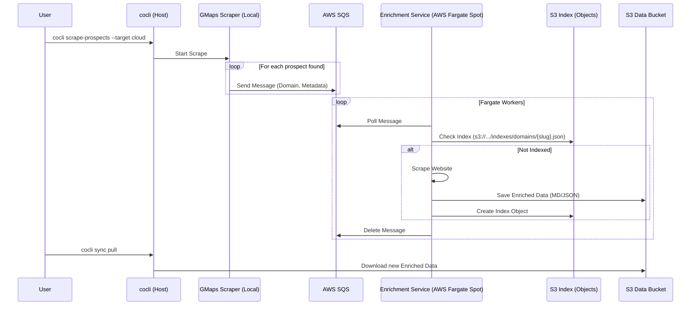

# Scenario: Local Scrape / Cloud Enrich

This scenario ("Hybrid") offloads the heavy lifting of website enrichment to the cloud while keeping the Google Maps scraping local (often for easier IP rotation control or session management).

## Description

1.  **Local Scrape:** The user runs the Google Maps scraper locally.
2.  **Queue Injection:** Found prospects are sent to an AWS SQS queue.
3.  **Cloud Enrichment:** A fleet of Fargate Spot instances consumes the queue and enriches websites in parallel.
4.  **Cloud Persistence:** Results are written directly to S3.

## Sequence Diagram

## Data Persistence

*   **Raw Data:** Local `prospects.csv` (can be synced to S3).
*   **Queue:** AWS SQS holds transient work items.
*   **Indexes:** **Object-per-Record** in S3 (`indexes/domains/{domain}.json`). This allows high concurrency from Fargate workers without locking a single CSV file.
*   **Enriched Data:** Stored directly in S3 as Markdown or JSON files.
