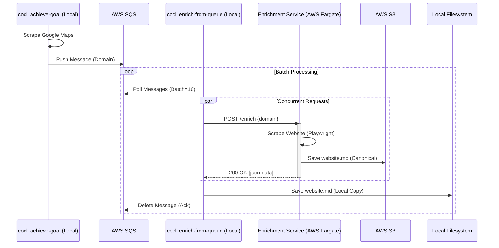

# Scenario: Hybrid Cloud (Local Orchestrator / Cloud Compute)

This scenario represents the currently implemented architecture. It combines the control of local scraping with the scalability of cloud enrichment.

## Description

1.  **Local Scrape (Producer):** The user runs `cocli campaign achieve-goal`. It scrapes Google Maps locally (safer for IPs) and pushes "Enrichment Candidate" messages to AWS SQS.
2.  **Cloud Queue:** SQS holds the backlog of domains to be enriched.
3.  **Local Orchestrator (Consumer):** The user runs `cocli campaign prospects enrich-from-queue`. This process:
    *   Polls SQS for a batch of messages.
    *   Sends concurrent HTTP POST requests to the Cloud Enrichment Service.
4.  **Cloud Enrich (Compute):** The Fargate Service (`EnrichmentService`) receives the request, spins up headless Chrome, scrapes the website, and returns the data.
5.  **Dual Persistence:**
    *   **Cloud:** The Fargate Service writes the canonical `website.md` directly to S3.
    *   **Local:** The Local Orchestrator receives the JSON response and writes it to the local filesystem.

## Sequence Diagram

## Key Benefits

*   **Decoupling:** Scraping can run continuously without waiting for slow enrichment.
*   **Scalability:** Enrichment capacity is defined by Fargate tasks (Server) and Client Batch Size (Orchestrator).
*   **Resilience:** SQS visibility timeouts handle crashes. Client-side "Poison Pill" logic handles infinite retries.
*   **Data Safety:** Data is dual-written. S3 acts as the immutable source of truth.