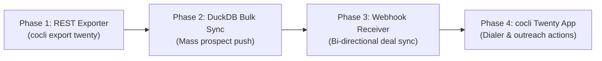

# Twenty CRM vs. Company CLI (`cocli`): Feature Comparison & Interoperability Architecture

**Date:** September 2026  
**Target System:** [Twenty CRM](https://twenty.com) (Nx/Yarn monorepo located at `~/repos/GitHub/twenty` and deployed via `~/repos/twenty-bizkite`)  
**Context:** Evaluating feature overlap, data interchange, plugin leverage, and the build-vs-interoperate tradeoff for web UI capabilities.

---

## Executive Summary

**`cocli` and Twenty are not competing CRM solutions; they represent two halves of a modern revenue generation stack.**

* **`cocli` is an Outbound Discovery & Cold Execution Engine:** Built for solo technical operators, it excels at distributed scraping (Raspberry Pi cluster), mass lead qualification, plain-text data longevity, cold sequence generation with UTM telemetry, Twilio voice bridging, and low-latency keyboard-driven terminal workflows.
* **`Twenty` is an Inbound Cockpit & Pipeline Collaboration CRM:** Built with React 18, NestJS, and PostgreSQL, it provides a Notion/Linear-grade visual web UI, visual Kanban pipelines, team collaboration, calendar/email synchronization, and an extensible application ecosystem (Call Recorder, Fireflies, People Data Labs, Exa, Slack, Linear).

### Strategic Verdict: Interoperate, Do Not Build a Custom Web UI
Building a custom web UI for `cocli` from scratch would require hundreds of engineering hours recreating tables, Kanbans, authentication, responsive styling, and role management. Instead, adopting the **"Engine + Cockpit"** architecture—where `cocli` serves as the cold prospecting engine and Twenty serves as the collaborative web interface for qualified opportunities—delivers immediate, enterprise-grade web capabilities while preserving `cocli`'s local-first terminal speed.

---

## 1. Architectural Philosophy & Technology Stack

| Architectural Dimension | Company CLI (`cocli`) | Twenty CRM (`twenty`) |
| :--- | :--- | :--- |
| **Core Paradigm** | Local-First, Plain-Text, Asynchronous Queue | Centralized Relational Client-Server, Web-First |
| **Primary User Persona** | Technical Founder / Operator, Power User, AI Agents | Sales Teams, Account Executives, Non-Technical Staff |
| **User Interface** | Textual TUI, CLI commands, vim navigation | React 18 SPA (Jotai, Linaria), Vite, Command Palette (`Cmd+K`) |
| **Primary Storage** | Markdown files (`YAML` frontmatter), USV queues | PostgreSQL 16 (TypeORM), Redis (BullMQ queues) |
| **Analytical Querying** | DuckDB over USV and Markdown indices | PostgreSQL relational queries, GraphQL, REST |
| **Data Sovereignty** | 100% plain text, Git-versionable, offline-capable | Self-hostable Docker container (`twenty-bizkite`), SQL exports |
| **AI / Agent Interface** | Antigravity CLI, Task-Agent Mission Queue, Local MCP | Native built-in MCP server (`twenty-server/src/engine/api/mcp`) |
| **Deployment Footprint** | Lightweight Python virtual environment, Pi worker containers | Multi-container Docker Compose (Node.js, Postgres, Redis) |

---

## 2. Feature Comparison Matrix

### A. Lead Generation & Prospecting
| Feature | `cocli` | `Twenty` | Winner / Commentary |
| :--- | :---: | :---: | :--- |
| **Distributed Scraping** | ✅ Native | ❌ None | **`cocli`**: Embedded cluster scraper with gossip protocol and Pi worker nodes. Twenty has zero native scraping capability. |
| **Google Maps Mining** | ✅ Native | ❌ None | **`cocli`**: Automated polygon search, detail extraction, rating/review scraping. |
| **Lead Qualification** | ✅ Native | ⚠️ Manual | **`cocli`**: Automated qualification through validation queues (`discovery-gen`, `to-call`). |
| **B2B Data Enrichment** | ⚠️ Scripted | ✅ Native Apps | **`Twenty`**: Out-of-the-box One-click People Data Labs (PDL) and Exa search enrichment apps. |

### B. Outbound Outreach & Communication
| Feature | `cocli` | `Twenty` | Winner / Commentary |
| :--- | :---: | :---: | :--- |
| **Cold Sequence Generation** | ✅ Native | ⚠️ Basic | **`cocli`**: Nunjucks/Markdown templates, UTM appending, personalized drafts, and SES dispatch. |
| **Draft Review & Previews** | ✅ TUI / HTML | ❌ None | **`cocli`**: Batch review queue with Pandoc terminal HTML rendering and browser previews. |
| **Telephony Bridge Dialing** | ✅ Native | ❌ None | **`cocli`**: Twilio voice bridge with audio fallback, Google Voice PWA, and Quo support. |
| **Meeting Bot Recording** | ❌ None | ✅ Native Apps | **`Twenty`**: `call-recorder`, `fireflies`, and `fathom` apps join Zoom/Meet/Teams, record audio, and generate AI summaries. |
| **Mailbox Two-Way Sync** | ⚠️ Outbound SES | ✅ Native | **`Twenty`**: Full OAuth 2-way sync with Google Workspace and Microsoft 365. |

### C. Pipeline & Opportunity Management
| Feature | `cocli` | `Twenty` | Winner / Commentary |
| :--- | :---: | :---: | :--- |
| **Visual Kanban Pipeline** | ❌ None | ✅ Native | **`Twenty`**: Drag-and-drop opportunity stages, deal amounts, and forecast dates. |
| **Multi-User Collaboration** | ❌ Git-based | ✅ Native | **`Twenty`**: User roles, mentions, notifications, assignment, and activity feeds. |
| **Dynamic Schema Editing** | ⚠️ Code changes | ✅ No-Code UI | **`Twenty`**: Create custom objects and custom fields directly from the settings UI. |
| **Search & Filtering** | ✅ Fast TUI | ✅ Web Grids | **Tie**: `cocli` offers instant terminal search; Twenty offers complex multi-condition web filters. |

---

## 3. Opportunities for Interoperability

Because Twenty is fully open-source with an open schema and comprehensive APIs, creating seamless data flow between `cocli` and Twenty is straightforward.

```
┌────────────────────────────────────────────────────────┐
│                   Company CLI (cocli)                  │
│                                                        │
│  [Scraper Cluster]  [DuckDB Indices]  [USV Queues]     │
│  [Twilio Bridge]    [SES Dispatch]    [Markdown Store] │
└───────────┬────────────────────────────────┬───────────┘
            │                                │
      1. REST / DuckDB                 2. Webhooks
     (Push Qualified Leads)           (Pull Booked Deals)
            │                                │
            ▼                                ▼
┌────────────────────────────────────────────────────────┐
│                   Twenty CRM Cockpit                   │
│                                                        │
│  [Web UI & Kanban]  [Postgres DB]     [Twenty Apps]    │
│  [Sales Reps]       [Meeting Bots]    [Email Sync]     │
└────────────────────────────────────────────────────────┘
```

### 3.1 Loading Data into Twenty (`cocli` &rarr; `Twenty`)

1. **REST API Ingestion (Recommended for Event-Driven Push)**
   Twenty auto-generates RESTful endpoints for all core and custom objects. When `cocli` qualifies a company or when a cold email receives an affirmative response:
   ```bash
   POST /rest/companies
   Authorization: Bearer <TWENTY_API_KEY>
   Content-Type: application/json
   {
     "name": "Blauner Financial",
     "domainName": "blaunerfinancial.com",
     "address": { "addressStreet1": "220 West Central Ave", "addressCity": "Brea", "addressState": "CA" },
     "idealCustomerProfile": true
   }
   ```
   *Implementation:* A lightweight command `cocli export twenty <slug>` or `cocli sync twenty --initiative=testimonials`.

2. **Direct DuckDB-to-PostgreSQL Bulk Attach (Recommended for Mass Sync)**
   `cocli` uses DuckDB for local indexing. DuckDB's PostgreSQL extension can attach directly to the `twenty-bizkite` database:
   ```sql
   INSTALL postgres; LOAD postgres;
   ATTACH 'dbname=default user=postgres password=postgres host=127.0.0.1 port=5432' AS twenty (TYPE POSTGRES);
   
   -- Bulk load qualified companies directly from DuckDB to Twenty's relational table
   INSERT INTO twenty.company (id, name, "domainName", "createdAt", "updatedAt")
   SELECT gen_random_uuid(), name, domain, now(), now()
   FROM read_csv('data/campaigns/roadmap/indexes/domains.csv')
   ON CONFLICT ("domainName") DO NOTHING;
   ```
   *Advantage:* Zero HTTP overhead, sub-second bulk synchronization of tens of thousands of scraped records.

3. **Native Model Context Protocol (MCP)**
   Twenty includes an MCP server (`packages/twenty-server/src/engine/api/mcp`). AI agents (e.g. Antigravity or Task-Agent) can inspect both repositories simultaneously, querying `cocli`'s local markdown files and writing directly to Twenty via MCP tools.

---

### 3.2 Reading Data out of Twenty (`Twenty` &rarr; `cocli`)

1. **Webhook-Driven Follow-Up Queueing**
   Twenty can fire webhooks when records change:
   * **Trigger:** An Opportunity is created or moved to "Booked Call" in Twenty.
   * **Action:** `cocli`'s local service receives the webhook and enqueues a phone call in `to-call.usv` or prepares a testimonial follow-up draft.
2. **Harvesting Meeting Transcripts & AI Summaries**
   Twenty's `call-recorder` app records meetings and saves transcripts. `cocli` can pull these transcripts down to Markdown files under `data/companies/<slug>/notes/YYYY-MM-DD-meeting.md`. This maintains `cocli`'s plain-text longevity mandate even when calls happen via web conferencing.

---

## 4. Build vs. Interoperate: The Web Interface Question

### The Cost of Building a Bespoke Web Interface for `cocli`
Building a web CRM UI that matches modern standards is deceptively expensive:
* **Frontend Surface Area:** Table virtualizers (handling 10,000+ rows), Kanban drag-and-drop, responsive layout, dark/light themes, inline editing, modals, validation.
* **Backend Infrastructure:** WebSockets/SSE for real-time updates, authentication/session management, authorization/roles, API gateways.
* **Maintenance Tax:** Every hour spent debugging React rendering loops, CSS layout quirks, or auth cookies is an hour not spent improving scraping, lead scoring, and closing deals.

### The Advantage of Using Twenty as the Web Cockpit
* **Zero UI Code to Maintain:** Twenty provides a polished interface built with modern React 18, Jotai, and Linaria.
* **Multi-User Collaboration:** Associates who dislike the terminal can use Twenty in Chrome, Safari, or on mobile to review prospects, manage deals, and write notes.
* **Preserve `cocli`'s Purity:** `cocli` stays a fast, single-binary, local-first engine with zero bloated web frontend dependencies in its core repo.

---

## 5. Integrating with Twenty's Plugin Ecosystem

Twenty provides a modular app architecture (`packages/twenty-apps/public/`):

1. **People Data Labs (`people-data-labs`)**
   * *What it does:* Enriches Companies and People with 30+ B2B fields (funding, headcount, executive profiles, tech stack).
   * *How `cocli` benefits:* When `cocli` pushes a bare company domain into Twenty, the PDL plugin enriches the company. `cocli` can then read back the enriched contact names and verified emails for its outreach sequences.
2. **Exa Semantic Search (`exa`)**
   * *What it does:* Performs neural search for company similarity and competitor discovery.
   * *How `cocli` benefits:* Can be used to discover lookalike prospects based on current high-converting customers.
3. **Call Recorder & AI Meeting Note-Takers (`call-recorder`, `fireflies`, `fathom`)**
   * *What it does:* Automatically joins Zoom/Google Meet calls, records audio/video, transcribes conversations, and produces structured AI summaries.
   * *How `cocli` benefits:* Eliminates manual meeting logging. `cocli` can sync these summaries into local CRM markdown notes.
4. **Slack / Teams / Discord Notifications**
   * *What it does:* Alerts team channels on deal progression or customer replies.
   * *How `cocli` benefits:* Outbound replies triggered by `cocli` email sequences notify sales reps in Slack via Twenty without requiring custom webhook infrastructure in `cocli`.
5. **Building a Dedicated `cocli` Twenty App**
   * We can build a lightweight Twenty App (`twenty-apps/public/cocli`) that injects custom buttons into Twenty's UI:
     * **"Bridge Dial via cocli"**: Triggers `cocli`'s Twilio bridge to call the user's phone and connect to the prospect.
     * **"Queue for Campaign Outreach"**: Enqueues the company into a specific `cocli` initiative.

---

## 6. Recommended Action Plan & Next Steps



1. **Phase 1: Lightweight REST Exporter (`cocli/integrations/twenty.py`)**
   * Implement a clean Python client using Twenty's standard `/rest/companies` and `/rest/people` endpoints.
   * Add CLI command: `cocli sync twenty --company=<slug>`.
2. **Phase 2: DuckDB PostgreSQL Bulk Sync**
   * Write an automated script utilizing DuckDB's Postgres extension to sync thousands of scraped roadmap/testimonial prospects directly into `twenty-bizkite`'s PostgreSQL database in seconds.
3. **Phase 3: Webhook Follow-Up Listener**
   * Set up a small webhook receiver to ingest deal updates and call recordings from Twenty back into `cocli`'s markdown files.
4. **Phase 4: Twenty App Integration**
   * Build a custom UI extension in Twenty for triggering phone bridge calls and campaign sequences directly from the browser.
