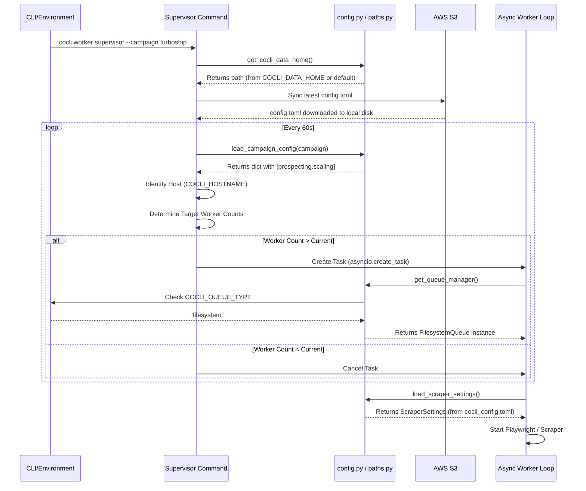

# cocli Settings Inventory & Configuration Flow

This document provides a comprehensive inventory of all configuration settings used by the `cocli` worker and supervisor systems, their sources, and the precedence rules for how they are applied.

## 1. Precedence Order

When a setting is defined in multiple places, `cocli` resolves the value using the following priority (highest to lowest):

1.  **Environment Variables**: Explicit overrides (e.g., `COCLI_QUEUE_TYPE`).
2.  **Command Line Flags**: Arguments passed to the CLI (e.g., `--workers 8`).
3.  **Campaign Config (`config.toml`)**: Settings specific to the current campaign.
4.  **Global Config (`cocli_config.toml`)**: User-level defaults.
5.  **Hardcoded Defaults**: Values defined in the Python source code.

---

## 2. Configuration Inventory

### 2.1. Infrastructure & Core Execution

| Setting | Source(s) | Usage |
| :--- | :--- | :--- |
| **Queue Type** | `COCLI_QUEUE_TYPE`, `cocli_config.toml` | Determines if workers use `sqs` or `filesystem`. |
| **Data Home** | `COCLI_DATA_HOME`, `cocli_config.toml` | The root directory for all business data (`cocli_data/`). |
| **Hostname** | `COCLI_HOSTNAME`, `socket.gethostname()` | Used by the supervisor to identify which scaling config to use. |
| **AWS Profile** | `AWS_PROFILE`, `config.toml [aws]` | The profile used for S3 uploads and SQS polling. |
| **Data Bucket** | `config.toml [aws]` | The S3 bucket where campaign and company data is stored. |

### 2.2. Worker Scaling (Per-Host)

Scaling is managed in the campaign `config.toml` under the `[prospecting.scaling]` section.

```toml
[prospecting.scaling]
"cocli5x0" = { scrape = 0, details = 0, enrichment = 8 }
"octoprint" = { scrape = 0, details = 0, enrichment = 4 }
```

*   **Key**: The host's identity (matches `COCLI_HOSTNAME`).
*   **Values**: Number of concurrent async tasks to launch for each worker type.

### 2.3. Scraper Throttling & Behavior

| Setting | Source(s) | Environment Override |
| :--- | :--- | :--- |
| **Delay Seconds** | `config.toml`, `cocli_config.toml` | `GOOGLE_MAPS_DELAY_SECONDS` |
| **Max Retries** | `cocli_config.toml [scraper]` | N/A |
| **Headless Mode** | `--headed`, `cocli_config.toml` | N/A |
| **Viewport Size** | `cocli_config.toml [scraper]` | N/A |

---

## 3. Configuration Flow Sequence

The following diagram shows how settings are loaded and propagated when the `supervisor` starts.



---

## 4. Key Implementation Files

*   **`cocli/core/paths.py`**: The central authority for resolving filesystem paths.
*   **`cocli/core/config.py`**: Handles loading and parsing of TOML configuration files.
*   **`cocli/core/queue/factory.py`**: Logic for selecting between SQS and Filesystem providers.
*   **`cocli/commands/worker.py`**: The orchestration logic for the supervisor and worker tasks.
