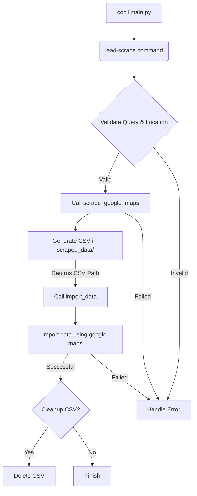

### Goal: Create a `lead-scrape` command that chains `scrape-google-maps` and `import-data`.

**High-Level Overview:**
The `lead-scrape` command will:
1.  Take a search query and location parameters (city/zip).
2.  Call the `scrape-google-maps` function to generate a CSV file in the `scraped_data` directory.
3.  Automatically take the newly generated CSV file.
4.  Call the `import-data` function with the `google-maps` importer and the path to the scraped CSV file.
5.  Optionally, clean up the scraped CSV file after successful import.

**Detailed Steps:**

1.  **Create a new command file**:
    *   Create a new Python file, e.g., `cocli/commands/lead_scrape.py`.
    *   Define a new Typer command `lead_scrape` within this file.

2.  **Define `lead_scrape` command arguments**:
    *   `query: str = typer.Argument(..., help="Search query for Google Maps.")`
    *   `zip_code: Optional[str] = typer.Option(None, "--zip", "-z", help="Zip code for location-based search.")`
    *   `city: Optional[str] = typer.Option(None, "--city", "-c", help="City and State (e.g., 'Brea,CA') for location-based search.")`
    *   `cleanup: bool = typer.Option(False, "--cleanup", "-x", help="Delete the scraped CSV file after successful import.")`
    *   `debug: bool = typer.Option(False, "--debug", help="Enable debug output for scraping and import.")`

3.  **Integrate `scrape-google-maps` logic**:
    *   Import `scrape_google_maps` from `cocli/commands/scrape.py`.
    *   Call `scrape_google_maps` from within `lead_scrape`, passing the `query`, `zip_code`, `city`, and the default `output_dir` (which is `get_scraped_data_dir()`).
    *   The `scrape_google_maps` function currently prints the path to the generated CSV. I will need to modify `scrape_google_maps` to *return* the path to the generated CSV file instead of just printing it, so `lead_scrape` can use it.

4.  **Integrate `import-data` logic**:
    *   Import `import_data` from `cocli/commands/import_data.py`.
    *   Call `import_data` from within `lead_scrape`, passing `importer_name="google-maps"`, the `file_path` returned by `scrape_google_maps`, and the `debug` flag.

5.  **Implement cleanup logic**:
    *   If `cleanup` is `True` and the import is successful, delete the scraped CSV file.

6.  **Error Handling**:
    *   Ensure robust error handling for both scraping and importing steps.

7.  **Update `cocli/main.py`**:
    *   Import the new `lead_scrape` command.
    *   Add it to the main Typer app.

8.  **Update `README.md`**:
    *   Add documentation for the new `lead-scrape` command.

**Dependencies and Interactions (Mermaid Diagram):**



**Refinement of `scrape_google_maps` (in `cocli/commands/scrape.py`):**
The `scrape_google_maps` function currently prints the CSV path. It needs to return it.

```python
# cocli/commands/scrape.py
# ...
def scrape_google_maps(
    # ... existing arguments ...
) -> Path: # Change return type to Path
    # ... existing logic ...
    try:
        # ... existing scraping logic ...
        csv_file_path = google_maps.scrape_google_maps(location_param, query, output_dir) # Assuming google_maps.scrape_google_maps also returns the path
        print(f"Scraping completed. Results saved to {output_dir}")
        return csv_file_path # Return the path
    except Exception as e:
        print(f"Error during scraping: {e}")
        raise typer.Exit(code=1)
```

And the `google_maps.scrape_google_maps` function (in `cocli/scrapers/google_maps.py`) also needs to return the path.