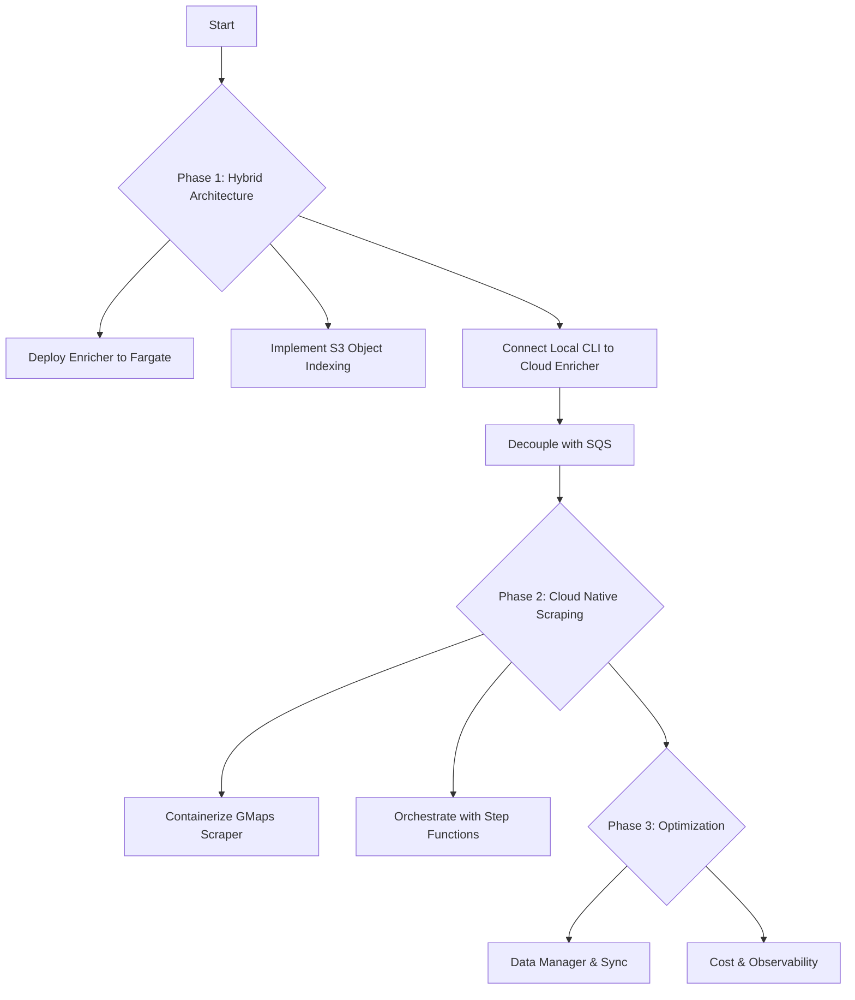

# Plan for `cocli` Development - Cloud Native Transition

This document outlines the roadmap for transitioning `cocli` from a purely local tool to a scalable, cloud-integrated platform using AWS Fargate and S3.

## Phase 1: Hybrid Architecture (Completed)

**Goal:** Establish foundational cloud integration for enrichment and initial data decoupling.

1.  **Deploy Enricher to Fargate:** Fargate service deployed for website enrichment.
2.  **Implement S3 Object Indexing:** S3 used for storing enriched data, with local indexes for fast lookups.
3.  **Connect Local CLI to Cloud Enricher:** Local CLI can trigger cloud enrichment.
4.  **Decouple with SQS:** Implemented `ScrapeTasksQueue` and `EnrichmentQueue` for asynchronous task processing.

## Phase 2: Cloud Native Scraping (In Progress)

**Goal:** Move the Google Maps scraper to the cloud for fully automated, scheduled data gathering, leveraging distributed local workers for scraping.

1.  **Distributed Scrape Worker Architecture:**
    *   [x] Implemented `ScrapeTask` model (Pydantic).
    *   [x] Implemented `cocli campaign queue-scrapes` command (Producer) to push tasks to `ScrapeTasksQueue`.
    *   [x] Implemented `cocli worker scrape` command (Consumer) to pull tasks, execute Playwright, and push results.
    *   [x] Created Makefile rules for `queue-scrape-tasks` and `run-worker-scrape-bg`.
    *   [x] **Deploy RPi Worker:** Successfully deployed headless worker on Raspberry Pi with secure credential transfer.
    *   [ ] **Containerize Scraper:** Package Playwright scraper into a Docker image (for Fargate, or other cloud deployments).
    *   [ ] Adapt scraper to read configuration from S3/Environment variables.
    *   [ ] **Proxy Integration:** Implement residential proxies to bypass Google blocking in data centers.

2.  **Decidegree Grid Planning (New):**
    *   [x] **Prototype Generator:** Created `generate_grid.py` to produce 0.1-degree aligned global grids.
    *   [ ] **Campaign Integration:** Update campaign scraper to use these grids instead of dynamic spiral search.
    *   [ ] **KML Visualization:** Generate "Target Grids" KMLs for all campaign locations to visualize coverage.

3.  **Orchestration:**
    *   [ ] Create AWS Step Functions state machine to coordinate Scrape -> Queue -> Enrich workflow.
    *   [ ] Schedule runs via EventBridge (Cron).

## Phase 3: Data Management & Optimization

**Goal:** robust data handling, cost optimization, and observability.

1.  **Unified Data Manager:**
    *   [x] **Completed:** Migrated prospects storage to a file-based index (`indexes/google_maps_prospects/`) to support deduplication and "Latest Wins" updates.
    *   [ ] Implement `DataSynchronizer` (`cocli sync`) for efficient bi-directional sync (now simpler with file index).

2.  **Optimization:**
    *   [ ] Use Fargate Spot for all compute.
    *   [ ] Implement strict lifecycle policies for S3 data.
    *   [ ] Add centralized logging and metrics (CloudWatch).

