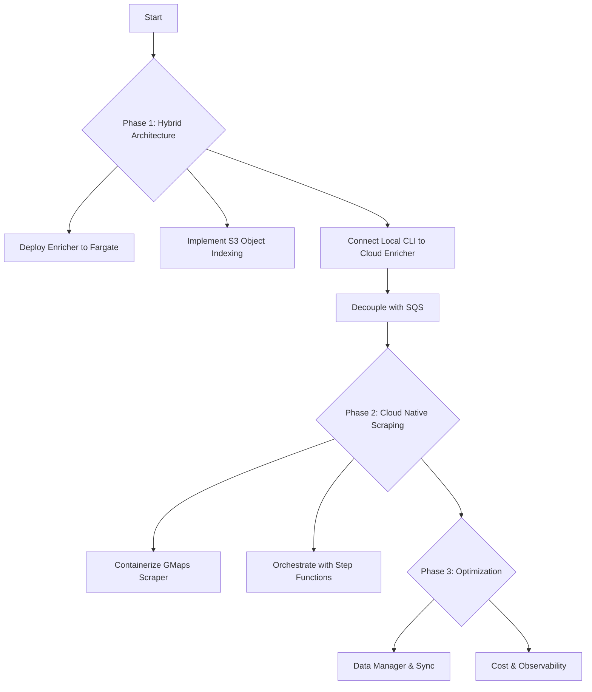

# Plan for `cocli` Development - Cloud Native Transition

This document outlines the roadmap for transitioning `cocli` from a purely local tool to a scalable, cloud-integrated platform using AWS Fargate and S3.

## Phase 1: Hybrid Architecture (Local Scrape / Cloud Enrich)

**Goal:** Offload the resource-intensive website enrichment process to the cloud while keeping the complex Google Maps scraping local for control.

1.  **Infrastructure Foundation (Completed):**
    *   [x] Design "Object-per-Record" indexing strategy for S3 concurrency.
    *   [x] Containerize Enrichment Service (Docker).
    *   [x] Set up ECR, ECS Cluster, and IAM Roles.
    *   [x] Deploy Enrichment Service to AWS Fargate Spot.
    *   [x] Implemented robust S3 session handling and tagging.
    *   [x] Integrated versioning into build and application logs.
    *   [x] Streamlined deployment process with `make deploy-enrichment` and version incrementing.
    *   [x] **HTTPS:** Secure ALB with ACM Certificate (`enrich.turboheat.net`).

2.  **CLI Integration (Completed):**
    *   [x] Update `cocli` to target remote Enrichment Service (Fargate IP/Load Balancer).
    *   [x] Implement `IndexConsolidator` logic (via `S3DomainManager`).
    *   [x] **Dedicated Consumer:** `cocli campaign prospects enrich-from-queue`.
    *   [x] **Robust Producer:** Fixed `achieve-goal` pipeline to correctly handle and queue existing companies for enrichment.
    *   [x] **CLI Command Clarity:** Renamed internal `set` command function to avoid shadowing Python's built-in `set()`, resolving a critical runtime `TypeError`.

3.  **Scalability (Completed):**
    *   [x] Introduce AWS SQS to decouple Scraper and Enricher.
    *   [x] **Manual Scaling:** Verified scaling Fargate tasks via CLI.
    *   [x] **Queue Visibility:** Integrated SQS stats into `make report`.

## Phase 2: Cloud Native Scraping

**Goal:** Move the Google Maps scraper to the cloud for fully automated, scheduled data gathering.

1.  **Containerize Scraper:**
    *   [ ] Package Playwright scraper into a Docker image.
    *   [ ] Adapt scraper to read configuration from S3/Environment variables.
    *   [ ] **Proxy Integration:** Implement residential proxies to bypass Google blocking in data centers.

2.  **Orchestration:**
    *   [ ] Create AWS Step Functions state machine to coordinate Scrape -> Queue -> Enrich workflow.
    *   [ ] Schedule runs via EventBridge (Cron).

## Phase 3: Data Management & Optimization

**Goal:** robust data handling, cost optimization, and observability.

1.  **Unified Data Manager:**
    *   [x] Finalize `S3CompanyManager` for canonical S3 storage.
    *   [x] **Local Data Recovery and Consolidation:** Recovered and standardized local `ScrapedArea` and `website-domains.csv` indexes.
    *   [x] **Config Stability:** Fixed TOML serialization for paths and null values.
    *   [ ] Implement `DataSynchronizer` (`cocli sync`) for efficient bi-directional sync.

2.  **Optimization:**
    *   [ ] Use Fargate Spot for all compute.
    *   [ ] Implement strict lifecycle policies for S3 data.
    *   [ ] Add centralized logging and metrics (CloudWatch).

