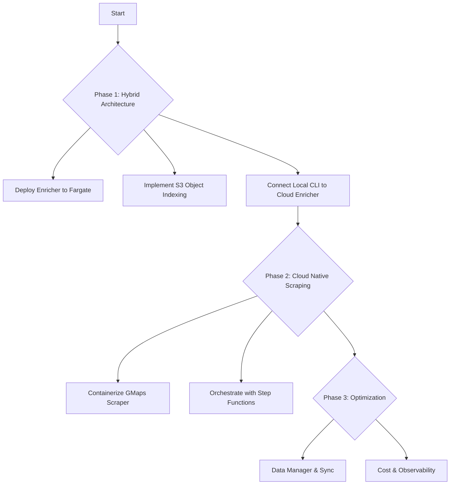

# Plan for `cocli` Development - Cloud Native Transition

This document outlines the roadmap for transitioning `cocli` from a purely local tool to a scalable, cloud-integrated platform using AWS Fargate and S3.

## Phase 1: Hybrid Architecture (Local Scrape / Cloud Enrich)

**Goal:** Offload the resource-intensive website enrichment process to the cloud while keeping the complex Google Maps scraping local for control.

1.  **Infrastructure Foundation (Completed):**
    *   [x] Design "Object-per-Record" indexing strategy for S3 concurrency.
    *   [x] Containerize Enrichment Service (Docker).
    *   [x] Set up ECR, ECS Cluster, and IAM Roles.
    *   [x] Deploy Enrichment Service to AWS Fargate Spot.
    *   [x] Implemented robust S3 session handling and tagging.
    *   [x] Integrated versioning into build and application logs.
    *   [x] Streamlined deployment process with `make deploy-enrichment` and version incrementing.

2.  **CLI Integration:**
    *   [ ] Update `cocli` to target remote Enrichment Service (Fargate IP/Load Balancer).
    *   [ ] Implement `IndexConsolidator` to merge S3 index objects into a local CSV for `cocli fz`.

3.  **Scalability:**
    *   [ ] Introduce AWS SQS to decouple Scraper and Enricher.
    *   [ ] Configure Fargate Auto Scaling based on queue depth.

## Phase 2: Cloud Native Scraping

**Goal:** Move the Google Maps scraper to the cloud for fully automated, scheduled data gathering.

1.  **Containerize Scraper:**
    *   [ ] Package Playwright scraper into a Docker image.
    *   [ ] Adapt scraper to read configuration from S3/Environment variables.

2.  **Orchestration:**
    *   [ ] Create AWS Step Functions state machine to coordinate Scrape -> Queue -> Enrich workflow.
    *   [ ] Schedule runs via EventBridge (Cron).

## Phase 3: Data Management & Optimization

**Goal:** robust data handling, cost optimization, and observability.

1.  **Unified Data Manager:**
    *   [ ] Finalize `DataManager` class in Python to abstract S3 vs Local FS.
    *   [ ] Implement `DataSynchronizer` for efficient `cocli sync`.

2.  **Optimization:**
    *   [ ] Use Fargate Spot for all compute.
    *   [ ] Implement strict lifecycle policies for S3 data.
    *   [ ] Add centralized logging and metrics (CloudWatch).

