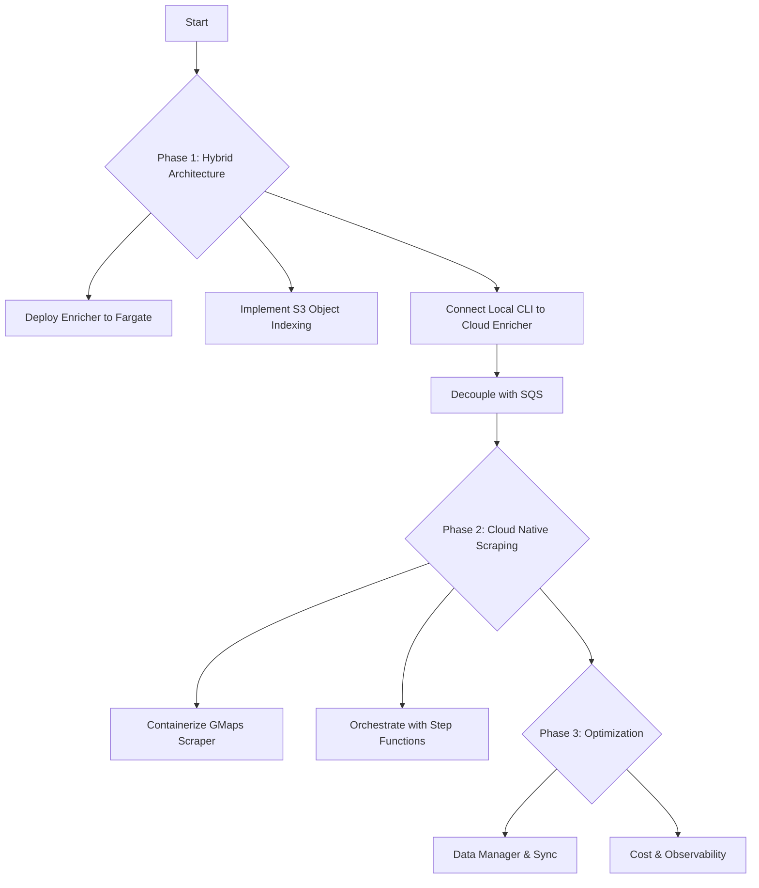

# Plan for `cocli` Development - Cloud Native Transition

This document outlines the roadmap for transitioning `cocli` from a purely local tool to a scalable, cloud-integrated platform using AWS Fargate and S3.

## Phase 2: Cloud Native Scraping

**Goal:** Move the Google Maps scraper to the cloud for fully automated, scheduled data gathering.

1.  **Containerize Scraper:**
    *   [ ] Package Playwright scraper into a Docker image.
    *   [ ] Adapt scraper to read configuration from S3/Environment variables.
    *   [ ] **Proxy Integration:** Implement residential proxies to bypass Google blocking in data centers.

2.  **Orchestration:**
    *   [ ] Create AWS Step Functions state machine to coordinate Scrape -> Queue -> Enrich workflow.
    *   [ ] Schedule runs via EventBridge (Cron).

## Phase 3: Data Management & Optimization

**Goal:** robust data handling, cost optimization, and observability.

1.  **Unified Data Manager:**
    *   [x] **Completed:** Migrated prospects storage to a file-based index (`indexes/google_maps_prospects/`) to support deduplication and "Latest Wins" updates.
    *   [ ] Implement `DataSynchronizer` (`cocli sync`) for efficient bi-directional sync (now simpler with file index).

2.  **Optimization:**
    *   [ ] Use Fargate Spot for all compute.
    *   [ ] Implement strict lifecycle policies for S3 data.
    *   [ ] Add centralized logging and metrics (CloudWatch).

