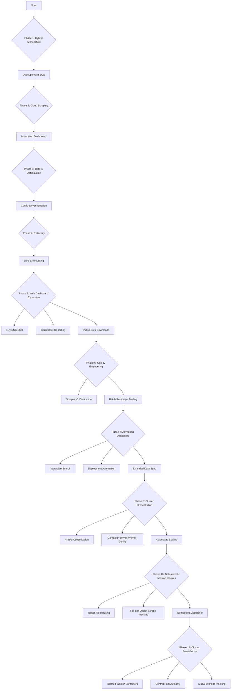

# Plan for `cocli` Development - Cloud Native Transition

This document outlines the roadmap for transitioning `cocli` from a purely local tool to a scalable, cloud-integrated platform using AWS Fargate and S3.

## Phase 1: Hybrid Architecture (Completed)

**Goal:** Establish foundational cloud integration for enrichment and initial data decoupling.

1.  **Deploy Enricher to Fargate:** Fargate service deployed for website enrichment.
2.  **Implement S3 Object Indexing:** S3 used for storing enriched data, with local indexes for fast lookups.
3.  **Connect Local CLI to Cloud Enricher:** Local CLI can trigger cloud enrichment.
4.  **Decouple with SQS:** Implemented `ScrapeTasksQueue` and `EnrichmentQueue` for asynchronous task processing.

## Phase 2: Cloud Native Scraping (Completed)

**Goal:** Move the Google Maps scraper to the cloud for fully automated, scheduled data gathering, leveraging distributed local workers for scraping.

1.  **Distributed Scrape Worker Architecture (Done):**
    *   [x] Implemented `ScrapeTask` model (Pydantic).
    *   [x] Implemented `cocli campaign queue-scrapes` command (Producer) to push tasks to `ScrapeTasksQueue`.
    *   [x] Implemented `cocli worker scrape` command (Consumer) to pull tasks, execute Playwright, and push results.
    *   [x] Implemented `cocli worker details` command (Consumer) for deep scraping.
    *   [x] **Deploy RPi Worker:** Successfully deployed headless worker on Raspberry Pi.
    *   [x] **Containerize Scraper:** Package Playwright scraper into a Docker image.

2.  **Decidegree Grid Planning (Completed):**
    *   [x] **Prototype Generator:** Created `generate_grid.py` to produce 0.1-degree aligned global grids.
    *   [x] **Campaign Integration:** Updated `queue-scrapes` to use the grid-based deduplication logic.
    *   [x] **KML Visualization:** Deployed dynamic KML viewer and S3 deployment logic.

3.  **Campaign-Agnostic Web Dashboard (Initial) (Completed):**
    *   [x] **Infrastructure:** Provisioned `cocli.turboheat.net` (S3 + CloudFront).
    *   [x] **KML Viewer:** Migrated `kml-viewer.html` to `cocli/web/`.
    *   [x] **Dynamic Context:** Shell fetches campaign data dynamically (e.g., `?campaign=turboship`).

## Phase 3: Data Management & Optimization (Completed)

**Goal:** robust data handling, cost optimization, and observability.

1.  **Unified Data Manager:**
    *   [x] **Migrated Prospects:** Storage moved to file-based index.
    *   [x] **Global Scrape Index:** Shared `scraped_areas` index on S3.
    *   [x] **DataSynchronizer:** Implemented `cocli smart-sync`.

2.  **Infrastructure Optimization:**
    *   [x] **Fargate Spot:** Enabled for Enrichment Service.
    *   [x] **Config-Driven Isolation:** Implemented `config.toml` auto-discovery for isolated campaign resources.
    *   [x] **Auto-Configuration Loop:** Created `scripts/update_campaign_infra_config.py`.

## Phase 4: Reliability & Process Hardening (Completed)

**Goal:** Ensure 100% uptime for distributed workers and zero-regression deployment.

1.  **Process Guardrails:**
    *   [x] **Zero-Error Linting:** Achieved state of 0 `mypy` and `ruff` errors.
    *   [x] **Build-Time Verification:** Integrated `ruff` and import checks into Docker build.
    *   [x] **Deployment Safety:** Enforced `ruff` check in `make deploy-rpi`.

2.  **Worker Reliability:**
    *   [x] **Container Resiliency:** Implemented `CAMPAIGN_NAME` env var fallback.
    *   [x] **Remote Bootstrapping:** RPi workers fetch `config.toml` from S3.

## Phase 5: Web Dashboard & Public Data Access (Completed)

**Goal:** Transform the web dashboard into a functional data hub for campaign stakeholders.

1.  **Modern Web Shell (11ty):**
    *   [x] Initialize `11ty` in `cocli/web/` for minimalist, component-based rendering.
    *   [x] Implement a shared navbar and layout (Material Design/Bootstrap).
    *   [x] Create a proper Home Page at `cocli.{hosted-zone-domain}/`.

2.  **Cached Reporting:**
    *   [x] **Report CLI:** Update `cocli report` to output `report.json`.
    *   [x] **S3 Statistics:** Implement S3-based counting logic for server-side reports.
    *   [x] **Refresh Mechanism:** Provide a "Refresh Report" action that updates the `report.json` and `last_updated` timestamp on S3.
    *   [x] **Dashboard Integration:** Render the `report.json` as a clean HTML table on the home page.

3.  **Public Data Downloads:**
    *   [x] **Automated Export Sync:** Update `make export-emails` to automatically upload the generated CSV to the campaign's S3 folder.
    *   [x] **Download Links:** Display the latest email export link and total email count on the home page.

## Phase 6: Quality Engineering & Data Enrichment (Completed)

**Goal:** Improve data yield and accuracy through advanced scraping techniques and targeted re-processing.

1.  **Scraper v6 Deployment (Done):**
    *   [x] Implement improved email extraction logic in `WebsiteScraper`.
    *   [x] Verify performance improvement with targeted re-scrape (verified 54% recovery on previous misses).

2.  **Batch Re-scrape Tooling (Done):**
    *   [x] Create scripts for identifying prospects missing emails (`list_prospects_missing_emails.py`).
    *   [x] Create enqueuing tools for batch re-processing (`enqueue_batch_from_csv.py`).
    *   [x] Implement evaluation and sync tools (`sync_results_from_s3.py`, `evaluate_batch_results.py`).

## Phase 7: Advanced Dashboard & Integrated Data Pipeline (Active)

**Goal:** Modernize the web UI for stakeholder self-service and automate the full data lifecycle from scrape to dashboard.

1.  **Interactive Dashboard UI:**
    *   [x] **Prospect Search:** Implement client-side filtering using PapaParse for fast, interactive search of exported CSV data.
    *   [x] **Multi-Tab Architecture:** Split UI into "Dashboard" (data/search) and "Config" (campaign parameters) for better UX.
    *   [x] **Layout Navigation:** Add persistent navigation links to the 11ty layout.

2.  **Deployment Automation:**
    *   [x] **Integrated Build:** Update `cocli web deploy` to automatically run `npm run build` (11ty) before S3 synchronization.
    *   [x] **Unified Export:** Ensure `make publish-all` captures all metadata, including the new `all_emails` fields for high-yield reporting.

3.  **Data Depth & Scale:**
    *   [x] **Full-Text Email Indexing:** Update `backfill_email_index.py` and `export_enriched_emails.py` to parse extended email lists.
    *   [x] **Large-Scale Sync:** Successfully synchronized ~10,000 cloud-enriched company records to local storage.



## Phase 9: Standardization & Distributed Coordination (Active)

**Goal:** Refactor for consistency across large-scale deployments and implement inter-node coordination.

1.  **Resource Naming Standardization:**
    *   [ ] Refactor CDK and infrastructure scripts to use consistent naming: `cocli-<resource>-<campaign>` (e.g., `cocli-data-roadmap`, `cocli-sqs-details-roadmap`).
    *   [ ] Update IAM policies to reflect the standardized naming pattern.

2.  **Distributed IP Throttling:**
    *   [ ] Implement a distributed semaphore (e.g., via SQS or Redis) to coordinate Google Maps requests across all cluster nodes sharing a single IP address.

3.  **Campaign-Driven Host Discovery:**
    *   [ ] Move worker hostnames (`octoprint.local`, etc.) into campaign `config.toml` to remove hardcoded host lists from the CLI.

## Phase 10: Deterministic Mission Indexes (Completed)

**Goal:** Eliminate brittle offset-based queueing in favor of a file-per-object "Mission Index" that is S3-syncable and inherently idempotent.

1.  **Campaign Target Index (Done):**
    *   [x] Implemented `cocli campaign build-mission-index` to generate files in `campaigns/{name}/indexes/target-tiles/{lat}/{lon}/{phrase}.csv`.
2.  **Global Scraped Index (Witness Files) (Done):**
    *   [x] Update `cocli worker scrape` to write a "witness file" to `data/indexes/scraped-tiles/{lat}/{lon}/{phrase}.csv` upon completion.
    *   [x] Enabled `smart-sync` for this global directory to share proof-of-work across the cluster.
3.  **Idempotent Dispatcher (Done):**
    *   [x] Refactor `queue-mission` to use a set-difference approach: `Pending = TargetIndex - GlobalScrapedIndex`.

## Phase 11: Cluster Powerhouse (Completed)

**Goal:** Harden the cluster against resource contention and path resolution errors.

1.  **Powerhouse Architecture (Done):**
    *   [x] Deprecate the single-process `supervisor` for high-load nodes.
    *   [x] Deploy isolated `scraper` and `details` containers to maximize CPU/Memory utilization.
2.  **Central Path Authority (ADR 009) (Done):**
    *   [x] Standardize all data path resolution via `cocli/core/config.py`.
    *   [x] Implement `ValidatedPath` to crash early on configuration errors.
3.  **Witness-Based Observability (Done):**
    *   [x] Updated KML and reporting tools to use the new `.csv` witness index for 100% accurate coverage mapping.

## Phase 12: Global Cleanup & Index Migration (Completed)

**Goal:** Formalize the new index structure and decommission legacy JSON files.

1.  **Index Archival (Done):**
    *   [x] Migrated remaining `scraped_areas/*.json` records into the `scraped-tiles/*.csv` format.
2.  **KML Enhancement (Done):**
    *   [x] Added witness-based mapping for 100% accurate coverage visualization.
3.  **Cluster Auto-Start (Done):**
    *   [x] Implemented supervisor poller auto-restart for maximum uptime.

## Phase 13: Distributed Filesystem Queue (DFQ) (Completed)

**Goal:** Transition from SQS to a decentralized, cost-effective queue using the mission index and atomic leases ([ADR 010](docs/adr/010-distributed-filesystem-queue.md)).

1.  **Lease Manager Implementation (Done):**
    *   [x] Implemented `cocli/core/queue/filesystem.py` with atomic `.lease` creation.
2.  **Provider Factory Integration (Done):**
    *   [x] Updated `get_queue_manager` to support `queue_type="filesystem"`.
3.  **Worker Migration (Done):**
    *   [x] Successfully deployed and verified DFQ across the RPi cluster.

## Phase 14: Remote Command Bridge & Real-time Ops (Active)

**Goal:** Bridge the gap between the web dashboard and remote workers for immediate, interactive campaign management.

1.  **Command Polling Architecture:**
    *   [x] Implement `CommandPoller` loop in the supervisor to listen for SQS-based dashboard commands.
    *   [x] Implement `CampaignService` for headless data modifications (Exclusions, Queries, Locations).
2.  **Real-time Synchronization:**
    *   [x] Implement "Targeted" sync-up and CloudFront invalidation to update web reports in <15s.
    *   [x] Decouple command execution from the 30-minute background sync loop.
3.  **Cluster Stabilization:**
    *   [ ] Optimize large-scale file synchronization for RPi nodes with slow I/O.
    *   [ ] Implement worker health heartbeats on the web dashboard.


```
