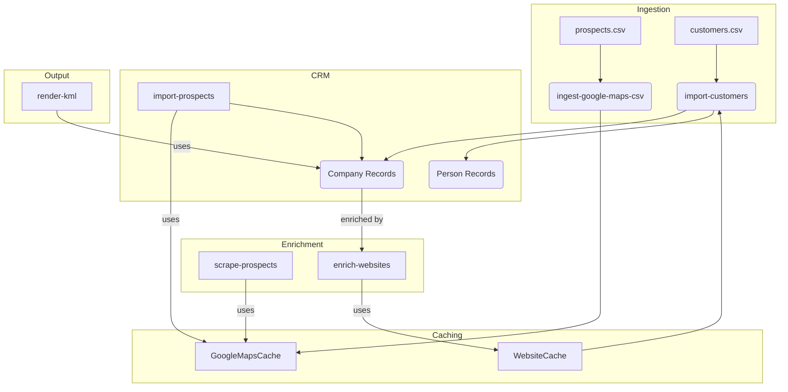

# Task: Architect and Implement a Robust Enrichment Pipeline

## Goal
The primary goal is to refactor the application's data enrichment process into a robust, efficient, and reusable pipeline. This involves moving away from campaign-specific scripts and adopting a more abstract, data-driven architecture based on standardized Pydantic models and a cache-first approach to expensive operations like web scraping.

## Achievements So Far

We have successfully completed **Phase 1** and the majority of **Phase 2** of our architectural refactoring.

### Phase 1: Caching Layer for Google Maps Data

1.  **"Pure" `GoogleMapsData` Model**: Created a `GoogleMapsData` Pydantic model in `cocli/models/google_maps.py` that is a "pure" representation of data from Google Maps and includes `created_at` and `updated_at` timestamps for data freshness.
2.  **`GoogleMapsCache` Service**: Implemented a `GoogleMapsCache` service in `cocli/core/google_maps_cache.py`. This class manages a global, persistent cache (`google_maps_cache.csv`) for all scraped Google Maps data, using the `Place_ID` as the unique key.
3.  **"Cache-First" Scraper**: Refactored the `scrape_google_maps` function to be "cache-first." It now intelligently queries the `GoogleMapsCache` and only performs a full scrape if the data is missing or stale (based on a configurable TTL).
4.  **Data Ingestion Command**: Created a generic `ingest-google-maps-csv` command to populate the `GoogleMapsCache` from existing CSV files.

### Phase 2: Website Enrichment Service (In Progress)

1.  **Enhanced `Website` Model**: Updated the `Website` Pydantic model to include `created_at` and `updated_at` timestamps, as well as `associated_company_folder` and `is_email_provider` fields to support more advanced use cases.
2.  **`WebsiteCache` Service**: Implemented a `WebsiteCache` service to manage a global cache for scraped website data, using the domain as the unique key.
3.  **Flexible Email Provider Flagging**: Created a `flag-email-providers` command that allows the user to dynamically manage a list of email provider domains in the `WebsiteCache`.
4.  **Generic Import Command**: Refactored the prospect import logic into a single, reusable `import-companies` command that can handle different CSV files and apply the correct tags (`prospect` or `customer`).

## Current Status

We have successfully initialized the application config, populated the email provider cache, and ingested the existing `prospects.csv` into the new `google_maps_cache.csv`. We are now in the process of creating a dedicated command to import the `customers.csv` data.

## Issues Faced & Resolved

1.  **Incorrect `typer` Command Registration**: Encountered and fixed several `NameError` bugs caused by the incorrect use of `app.add_typer` for simple commands.
2.  **Misleading Output Messages**: Corrected the output of the ingestion script to be more accurate about a `create` vs. `update` operation.
3.  **Schema Mismatches**: Identified that the `customers.csv` file has a different schema than `prospects.csv`, which required a dedicated import command instead of a generic one.
4.  **Data Freshness and Caching Strategy**: Refined the architectural plan to think of the local data store as a "cache" rather than a "single source of truth," which led to the crucial addition of `updated_at` timestamps for managing data freshness.

## Next Steps

1.  **Create the `import-customers` Command**: This is the immediate next step. This command will be specifically designed to:
    *   Read both `customers.csv` and `customer_addresses.csv`.
    *   Correctly parse and merge the data.
    *   Create the corresponding `Person` and `Company` objects in the main CRM.
    *   Apply the `customer` and `turboship` tags.

2.  **Complete the Test Plan**: After the `import-customers` command is created, we will proceed with the rest of the test plan:
    *   `make import-prospects`
    *   `make import-customers`
    *   `make scrape-prospects` (to test the cache)
    *   `make enrich-websites`

3.  **Phase 3: Refactor KML Renderers**: Once the data ingestion and enrichment pipeline is complete and tested, we will move on to the final phase of refactoring the KML renderers to use our new, standardized Pydantic models.

## Architectural Vision (Mermaid Diagram)

